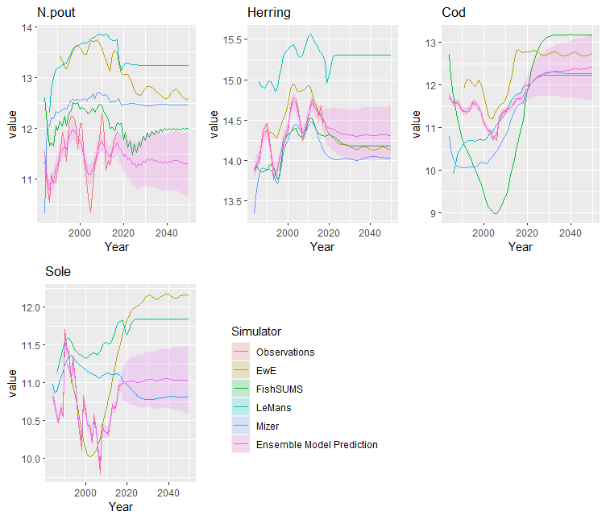

# EcoEnsemble

EcoEnsemble is an R package to set up, fit and sample from the ensemble framework described in [Spence et al (2018)](https://onlinelibrary.wiley.com/doi/abs/10.1111/faf.12310) for time series outputs.

## Installation
You can install the development version of EcoEnsemble using the `devtools` package:
``` r
library(devtools)
install_github("CefasRepRes/EcoEnsemble")
```

## Example
Fitting an ensemble model in EcoEnsemble is done in three main steps:

1. Eliciting priors on discrepancy terms: This is done by using the `EnsemblePrior()` constructor.
2. Fitting the ensemble model: Using the `fit_ensemble_model()` function with simulator outputs, observations and prior information. The ensemble model can be fit, obtaining either the point estimate, which maximises the posterior density, or running Markov chain Monte Carlo to generate a sample from the posterior denisty of the ensemble model.
3. Sampling the latent variables from the fitted model: Using the `generate_sample()` function with the fitted ensemble object, the discrepancy terms and the ensemble's best guess of the truth can be generated. Similarly to `fit_ensemble_model()`, this can either be a point estimate or a full sample.


We illustrate this process with datasets included with the package. EcoEnsemble comes loaded with the predicted biomasses of 4 species from 4 different mechanistic models of fish populations in the North Sea. It also includes statistical estimates of the biomasses from single-species stock assessments, and covariances for the model outputs and assessments. The models are run for different time periods and different species.

```{r}
library(EcoEnsemble)
# Outputs from mizer. These are logs of the biomasses for each year in a simulation.
print(SSB_miz)
```


|   |N.pout | Herring   |Cod  |Sole|
|---|---    |---        | --- |--- | 
|1984| 10.31706 |13.33601 |10.80006 |10.98139|
|1985| 12.07673 |13.63592 |10.46646 |10.87285|
|...|...|...|...|...|
|2049| 12.46354 |14.02923 |12.27473 |10.80954|
|2050| 12.46509 |14.03027 |12.27422 |10.81003|


To encode prior beliefs about how model discrepancies are related to one another, use the `EnsemblePrior()` constructor. Default values are available.

```{r}
priors <- EnsemblePrior(4)
```

or custom priors can be specified.

``` {r}
#Endoding prior beliefs. Details of the meanings of these terms can be found in the vignette or the documentation
num_species <- 4
priors <- EnsemblePrior(
  d = num_species,
  ind_st_params = IndSTPrior("lkj",  list(3, 2), 3, AR_params = c(1,1)),
  ind_lt_params = IndLTPrior(
    "beta",
    list(c(10,4,8, 7),c(2,3,1, 4)),
    list(matrix(5, num_species, num_species),
         matrix(0.5, num_species, num_species))
  ),
  sha_st_params = ShaSTPrior("inv_wishart",list(2, 1/3),list(5, diag(num_species))),
  sha_lt_params = 5,
  truth_params = TruthPrior(num_species, 10, list(3, 3), list(10, diag(num_species)))
)
```

This creates an `EnsemblePrior` object, which we can use to fit the ensemble model using the `fit_ensemble_model()` function and the data loaded with the package. When running a full MCMC sampling of the posterior, this step may take some time. Samples can then be generated from the resulting object using the `generate_sample()` function.


```{r}
fit <- fit_ensemble_model(observations = list(SSB_obs, Sigma_obs),
                          simulators = list(list(SSB_ewe, Sigma_ewe, "EwE"),
                                            list(SSB_lm,  Sigma_lm,  "LeMans"),
                                            list(SSB_miz, Sigma_miz, "mizer"),
                                            list(SSB_fs,  Sigma_fs,  "FishSUMS")),
                          priors = priors)
samples <- generate_sample(fit)
```
This produces an `EnsembleSample` object containing samples of the ensemble model predictions. These can be viewed by calling the `plot()` function on this object. For a full MCMC sample, this includes ribbons giving quantiles of the ensemble outputs. If only maximising the posterior density, then only the single ouput is plotted.
```{r}
plot(samples)
```



## References
Spence, M. A., J. L. Blanchard, A. G. Rossberg, M. R. Heath, J. J. Heymans, S. Mackinson, N. Serpetti, D. C. Speirs, R. B. Thorpe, and P. G. Blackwell. 2018. “A General Framework for Combining Ecosystem Models.” *Fish and Fisheries* 19: 1013–42.
