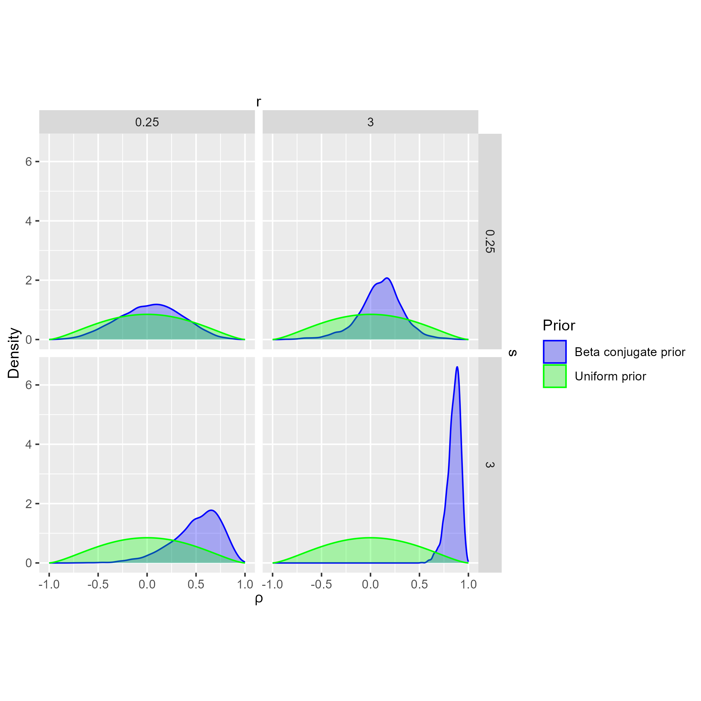
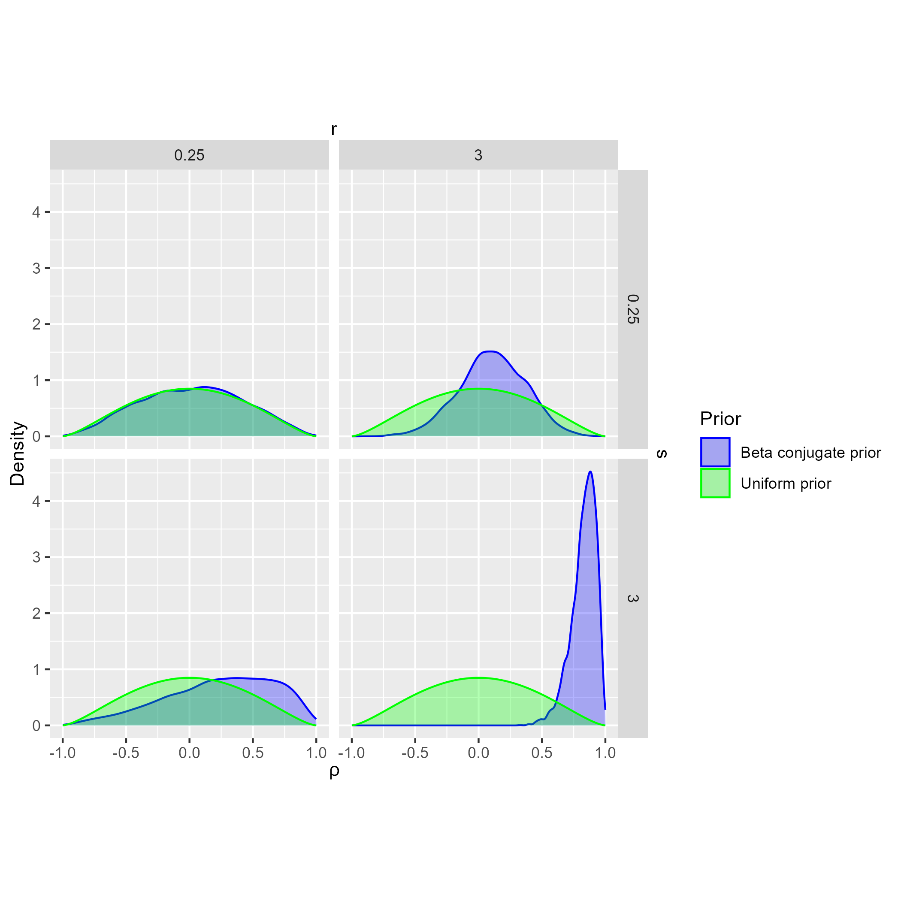
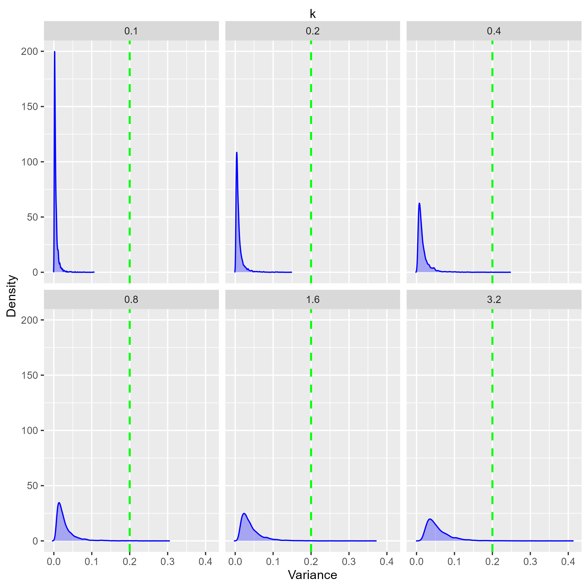
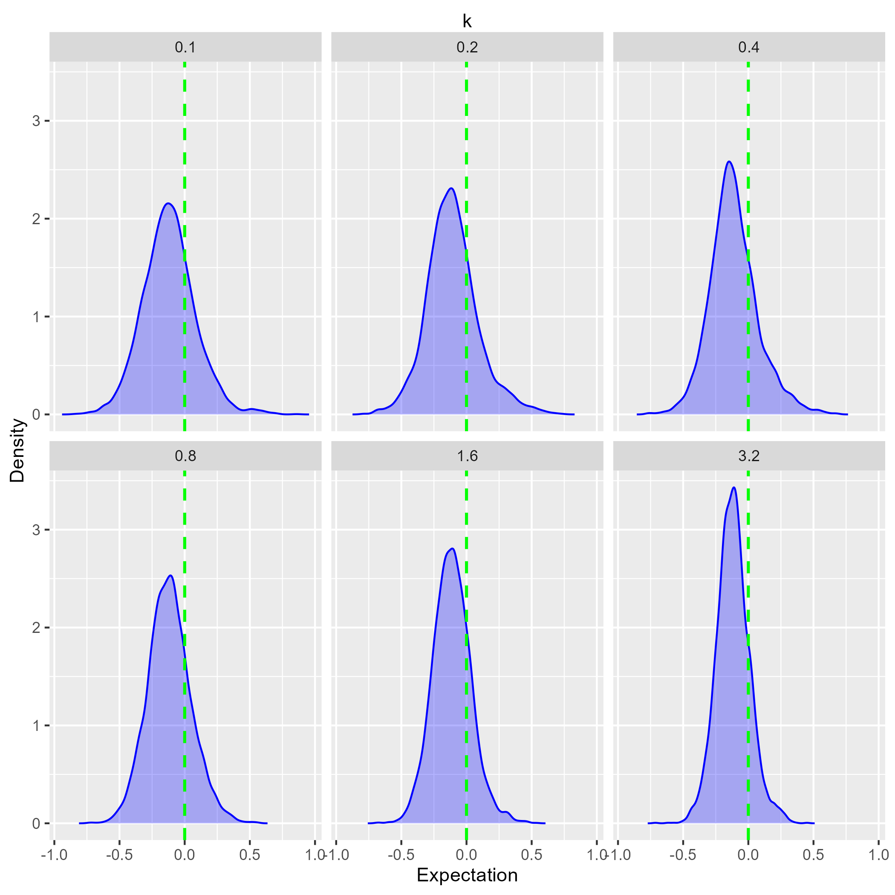
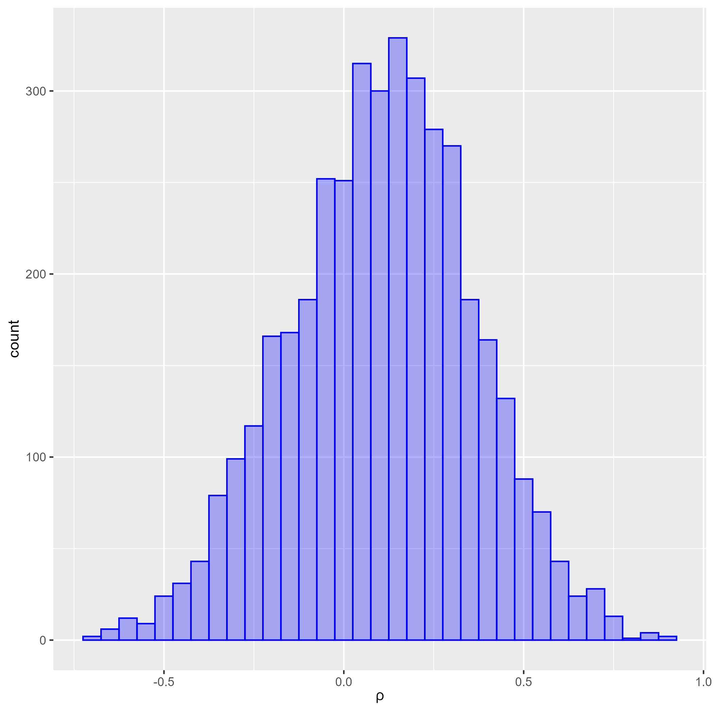
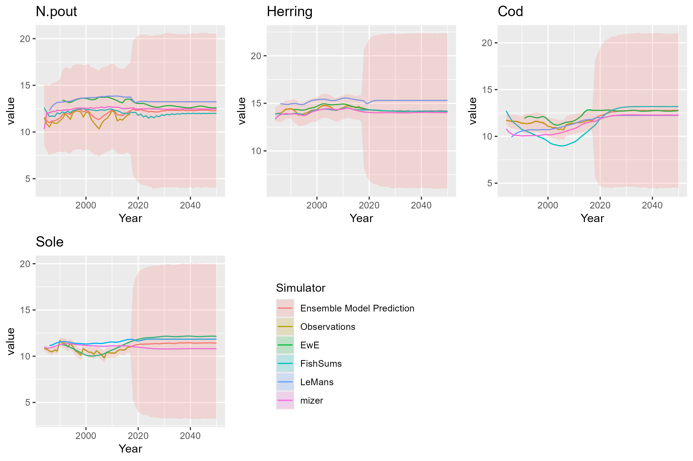

```{r setup_lies,warning=FALSE}
library(EcoEnsemble)
set.seed(1234)
```

## Introduction

In this document we demonstrate the use of the beta conjugate prior distribution for the hyperparameters of the hierarchical prior for the correlation matrix entries governing the dependencies of the individual short-term discrepancy dynamics between variables of interest. We demonstrate the usage based on the built-in example of four fish species in the North Sea.

## Short-term individual discrepancy

Suppose we have $M$ simulators with up to $N$ variables of interest predicted by each simulator. The short-term individual discrepancy for the $m$th model follows an auto-regressive process,
\begin{equation*}
\mathbf{z}_{m}^{(t)}\sim{}N(R_{m}\mathbf{z}_{m}^{(t-1)},\Lambda_{m})
\end{equation*}
with $R_{m}=\text{diag}(r_{m,1},\ldots,r_{m,4})$
\begin{equation*}
\Lambda_{m} = \Pi_{m}  P_{m} \Pi_{m},
\end{equation*}
where $P_{m}$ is a correlation matrix and $\Pi_{m}=\text{diag}(\pi_{m,1},\ldots,\pi_{m,4})$.

The distribution is
\begin{equation}
    f(P_m | \alpha, \beta) \propto \begin{cases}
    \prod_{i = 1}^{N-1}\prod_{j = i+ 1}^{N} \frac{1}{\mathrm{B}(\alpha_{\rho,i,j}, \beta_{\rho,i, j})} s(P_{m,i,j})^{\alpha_{\rho,i, j} - 1}\left(1-s(P_{m,i, j})\right)^{\beta_{\rho,i, j} - 1}&\text{if }P_{m}\text{ is positive definite}\\
    0 &\text{otherwise}.
    \end{cases}
\end{equation}
with 
\begin{equation}
    s(\rho)=\frac{\rho+1}{2},
\end{equation}
and where we need to also specify hyperpriors on the hyperparameters $\alpha_{\rho, i, j}$ and $\beta_{\rho, i, j}$. Conditional on $P_m$ being positive definite, the marginal distribution of each off-diagonal entry of $P_m$ is a scaled beta distribution. Hence one option is to place a conjugate prior on the parameters of the derived un-scaled beta distribution, which means placing a conjugate prior on the joint distribution of $(\alpha_{\rho, i, j}, \beta_{\rho, i,j})$. It is known that up to proportionality, this prior is ([https://en.wikipedia.org/wiki/Conjugate_prior][@conj_prior_wiki]),
\begin{equation}
g(\alpha_{\rho, i, j}, \beta_{\rho, i,j}\,|\,p, q, k) \propto \frac{\Gamma(\alpha_{\rho, i, j} + \beta_{\rho, i, j})^{k}p^{\alpha_{\rho, i, j}}q^{\beta_{\rho, i, j}}}{\Gamma(\alpha_{\rho, i, j})^{k}\Gamma(\beta_{\rho, i, j})^{k}}\,,   
\end{equation}
for given positive real parameters $p$, $q$ and $k$. We refer to the distribution defined by the above density as the *Beta conjugate prior*. The interpretation of the prior in the case that $k$ is a positive integer and $0 < p\,,\,q < 1$ is that $\alpha_{\rho, i, j}$ and $\beta_{\rho, i, j}$ have been estimated from $k$ observations with product $p$ and product of complements $q$. The equivalent of an improper prior occurs when $k \approx 0$ and $p = q = 1$.

## Exploring the prior

### New parameterisation

We introduce a new parameterisation $(r, s, k)$ of the Beta conjugate prior, which restricts the original parameters $(p, q, k)$ to a subspace of reasonable choices available to the user. We keep $k > 0$ the same and assume we can express the original parameters as $p = z^{k}w^k$ and $q = (1-z)^{k}w^k$ where we require $0 \leq z, w \leq 1$. Then we set $r$ to be the logit transform of $z$, $r = \log\big(\frac{z}{1-z}\big) = \frac{1}{k}\log\big(\frac{p}{q}\big)$. The second parameter is a scale parameter $s$ controlling the order of magnitude of $p$ and $q$, which we define as the logit transform of $w$, $s = \log\big(\frac{w}{1-w}\big)$.
In the case that $k$ is an integer we can interpret the values $z$, $w$ and $k$ as follows: we form our prior using $k$ observations $x_{1}, \ldots, x_{k}$ of a Beta distribution where $w$ is the sum of the geometric means of the observations $x_i$ and observed complements $1-x_{i}$:
$$w = \bigg(\prod_{i = 1}^{k}x_{i}\bigg)^{\frac{1}{k}} + \bigg(\prod_{i = 1}^{k}(1-x_{i})\bigg)^{\frac{1}{k}}\,.$$
We interpret $z$ as the ratio of the geometric mean of the observations $x_i$ to $w$:
$$z = \frac{\bigg(\prod_{i = 1}^{k}x_{i}\bigg)^{\frac{1}{k}}}{\bigg(\prod_{i = 1}^{k}x_{i}\bigg)^{\frac{1}{k}} + \bigg(\prod_{i = 1}^{k}(1-x_{i})\bigg)^{\frac{1}{k}}}\,.$$
Note however, that $k$ need not be integer-valued in general. In the plots below, we show the marginal distribution of $\rho_{m,1,2}$ with $m = 5$ in a number of cases, with the green curve being the resulting marginal of the LKJ(1) distribution, which gives a uniform distribution over all correlation matrices (@lkj). Sampling from the prior with $k = 0.05$ we have
```{r eval = FALSE, message=FALSE, warning=FALSE, results='hide', silent=TRUE}
cor_pri_st <- rstan::stan_model(model_code = " functions{
  real priors_cor_hierarchical_beta(matrix ind_st_cor, int N, matrix M){
    real log_prior = 0;
    for (i in 1:(N-1)){
      for (j in (i+1):N){
        log_prior += beta_lpdf(0.5*(ind_st_cor[i, j] + 1)| M[i, j], M[j, i] );
      }
    }
    return log_prior;
  }

  real beta_conj_prior(real alpha, real betas, real r, real s, real k){
    real rl = 1/(1 + exp(-r));
    real sl = 1/(1 + exp(-s));
    real p = (sl * rl)^k;
    real q = (sl * (1 - rl))^k;
    real ret = alpha * log(p) + betas * log(q) - k * lbeta(alpha,betas);
    return ret;
  }

}

data {
  vector[3] cor_p;
}

parameters {
  matrix <lower=0>[5,5] beta_pars;
  corr_matrix[5] rho[4];
}

model {
  for (i in 1:4){
    for (j in (i+1):5){
      target += beta_conj_prior(beta_pars[i,j], beta_pars[j,i], cor_p[1], cor_p[2], cor_p[3]);
    }
  }

  for (i in 1:4){
    target += priors_cor_hierarchical_beta(rho[i],5,beta_pars);
    diagonal(beta_pars) ~ std_normal();
  }

}

generated quantities {

  matrix [5,5] rhovars;
  for (i in 1:4){
    for (j in (i+1):5){
      rhovars[i,j] = 4 * (beta_pars[i,j] * beta_pars[j,i])/(square(beta_pars[i,j] + beta_pars[j,i]) * (beta_pars[i,j] + beta_pars[j,i] + 1));
      rhovars[j,i] = (2 * beta_pars[i,j]/(beta_pars[i,j] + beta_pars[j,i])) - 1;
    }
  }
  
  for (i in 1:5){
    rhovars[i,i] = 4;
  }
  
}
")
library(ggplot2)
rhoplots <- list()
kvals <- c(0.05, 5)
parvals <- do.call(expand.grid, c(rep(list(c(0.25, 3)), 2), list(kvals)))
#Sampling and gathering outputs for plotting
for (i in 1:nrow(parvals)){
  fit_cor <- rstan::sampling(cor_pri_st, data = list(cor_p=as.numeric(parvals[i,])), iter = 2000, chains=4)
  ex.fit <- rstan::extract(fit_cor)
  rho_density <- density(ex.fit$rho[,1,1,2], from = -1, to = 1)
  rhoplot_data <- data.frame(rho_density$x, rho_density$y)
  names(rhoplot_data) <- c("rho", "Density")
  rhoplot_data <- cbind(rhoplot_data, rep(parvals[i,1], nrow(rhoplot_data)), rep(parvals[i,2], nrow(rhoplot_data)), rep(parvals[i,3], nrow(rhoplot_data)))
  names(rhoplot_data)[3:5] <- c("r", "s", "k")
  rhoplots[[i]] <- rhoplot_data
}
#Construct plots
rhoplot_data <- do.call(rbind, rhoplots)
rhoplot_data <- cbind(rhoplot_data, rep("Beta conjugate prior", nrow(rhoplot_data)))
names(rhoplot_data)[6] <- "Prior"
unif_range <- seq(-1, 1, length.out = nrow(rhoplots[[1]]))
unif_data <- data.frame(cbind(rep(unif_range, nrow(parvals)), rep(dbeta((unif_range+1)/2,5/2,5/2)/2, nrow(parvals)), rhoplot_data[,3:5], rep("Uniform prior", nrow(rhoplot_data))))
names(unif_data) <- names(rhoplot_data)
rhoplot_data <- rbind(rhoplot_data, unif_data)
rhoplot1 <- ggplot(rhoplot_data[which(rhoplot_data$k == kvals[1]),]) + geom_area(aes(x = rho, y = Density, color = Prior, fill = Prior), alpha = 0.3, position = "identity") + scale_x_continuous(bquote(rho), sec.axis = sec_axis(~., name = "r", breaks = NULL, labels = NULL)) + scale_y_continuous(sec.axis = sec_axis(~., name = "s", breaks = NULL, labels = NULL)) + theme(aspect.ratio = 1) + facet_grid(rows = vars(r), cols = vars(s)) + scale_color_manual(values = c("blue", "green")) + scale_fill_manual(values = c("blue", "green"))
rhoplot2 <- ggplot(rhoplot_data[which(rhoplot_data$k == kvals[2]),], aes(x = rho, y = Density)) + geom_area(aes(color = Prior, fill = Prior), alpha = 0.3, position = "identity") + scale_x_continuous(bquote(rho), sec.axis = sec_axis(~., name = "r", breaks = NULL, labels = NULL)) + scale_y_continuous(sec.axis = sec_axis(~., name = "s", breaks = NULL, labels = NULL)) + theme(aspect.ratio = 1) + facet_grid(rows = vars(r), cols = vars(s)) + scale_color_manual(values = c("blue", "green")) + scale_fill_manual(values = c("blue", "green"))
```

```{r, echo = FALSE, out.width="700px", out.height="700px"}

```

```{r, eval = FALSE, fig.dim = c(7,6), echo = FALSE}
rhoplot1
```

and for $k = 5$ we have

```{r, echo = FALSE, out.width="700px", out.height="700px"}

```

```{r, eval = FALSE, fig.dim = c(7,6), echo = FALSE}
rhoplot2
```
Note that in the case $k = 0.05$, we see that choosing $r$ large we get a reduced variance compared to the uniform prior equivalent. This is more pronounced in the case $k = 0.5$. In general, as $k$ gets smaller, this can be interpreted as having less prior information and so the variance of $\rho$ is increased. Note that increasing $s$ has also yielded a more skewed prior as larger $s$ puts greater density on beta distributions with large $\alpha$ and $\beta$ (whether symmetric or not). To understand the effect of increasing $k$, we plot the sampled variances and expectations of $\rho$ for six different values of $k$ but with other parameters fixed, $r = -0.3$, $s = 3$.

```{r, message=FALSE, warning=FALSE,eval=FALSE, results='hide', silent=TRUE}
kvals <- c(0.1, 0.2, 0.4, 0.8, 1.6, 3.2)
#parvals <- cbind(rep(0.3, 6), rep(-1, 6), kvals)
parvals <- cbind(rep(-0.3, 6), rep(3, 6), kvals)
rhovarplots <- list()
rhomeanplots <- list()
for (i in 1:6){
  fit_cor <- rstan::sampling(cor_pri_st, data = list(cor_p=parvals[i,]), iter = 2000, chains=4)
  ex.fit <- rstan::extract(fit_cor)
  rhovar_density <- density(ex.fit$rhovars[,1,2])
  rhomean_density <- density(ex.fit$rhovars[,2,1])
  rhovar_data <- data.frame(cbind(rhovar_density$x, rhovar_density$y, rep(kvals[i], length(rhovar_density$x))))
  rhomean_data <- data.frame(cbind(rhomean_density$x, rhomean_density$y, rep(kvals[i], length(rhomean_density$x))))
  names(rhovar_data) <- c("Variance", "Density", "k")
  names(rhomean_data) <- c("Expectation", "Density", "k")
  rhovarplots[[i]] <- rhovar_data
  rhomeanplots[[i]] <- rhomean_data
}
rhovarplot_data <- do.call(rbind, rhovarplots)
rhomeanplot_data <- do.call(rbind, rhomeanplots)
rhovarplot <- ggplot(rhovarplot_data) + geom_area(aes(x = Variance, y = Density), color = "blue", fill = "blue", alpha = 0.3, position = "identity") + geom_vline(xintercept = 0.2, color = "green", linetype = "dashed", linewidth = 0.8) + facet_wrap(vars(k), nrow = 2, ncol = 3) + scale_x_continuous(sec.axis = sec_axis(~., name = "k", breaks = NULL, labels = NULL))
rhomeanplot <- ggplot(rhomeanplot_data) + geom_area(aes(x = Expectation, y = Density), color = "blue", fill = "blue", alpha = 0.3, position = "identity") + geom_vline(xintercept = 0, color = "green", linetype = "dashed", linewidth = 0.8) + facet_wrap(vars(k), nrow = 2, ncol = 3) + scale_x_continuous(sec.axis = sec_axis(~., name = "k", breaks = NULL, labels = NULL))
```

```{r, echo = FALSE, out.width="600px", out.height = "500px"}

```

```{r, eval = FALSE, echo = FALSE}
rhovarplot
```
Note that in this case increasing $k$ leads to increased variance of $\rho$. The dashed green line at 0.2 indicates the variance of the marginal distribution of LKJ(1) correlation parameters, the uniform equivalent.

```{r, echo = FALSE, out.width = "600px", out.height = "500px"}

```

```{r, eval=FALSE, fig.dim = c(8,5), echo = FALSE}
rhomeanplot
```

Note that as $k$ increases the variance of the expectation of $\rho$ decreases. 

## Prior predictive distribution
As an example of using the Beta conjugate prior for the short-term individual discrepancy correlations, we sample from the prior predictive distribution of the ensemble model in the case of four species with $r = 0.25, s = 3$ and $k = 4$ as our hyperparameters. We first draw from the the marginal prior distribution of the first off-diagonal correlation matrix entry $\rho_{m,1,2}$. We plot these draws below: 
```{r, eval = FALSE, message = FALSE, warning = FALSE, silent = TRUE, results = 'hide'}
fit_cor <- rstan::sampling(cor_pri_st, data = list(cor_p=c(0.25, 3, 4), iter = 2000, chains=4))
ex.fit <- rstan::extract(fit_cor)
rhoplot_data  <- data.frame(ex.fit$rho[,1,1,2])
names(rhoplot_data) <- "rho"
rhoplot <- ggplot(rhoplot_data) + geom_histogram(aes(x = rho), color = "blue", fill = "blue", alpha = 0.3, binwidth = 0.05) + scale_x_continuous(bquote(rho))
```

```{r, echo = FALSE, out.width = "400px", out.height = "400px"}

```

```{r, eval = FALSE, echo = FALSE, warning = FALSE, fig.dim = c(4,3)}
rhoplot
```

The prior predictive distribution is then
```{r,eval=FALSE,message=FALSE, warning = FALSE, results = 'hide',silent=TRUE}
priors <- EnsemblePrior(4,
                        ind_st_params =IndSTPrior("hierarchical_beta_conjugate",list(-3,1,8,4),
                                                  list(0.25,3,4),AR_params=c(2,2)),
                        ind_lt_params = IndLTPrior("lkj",list(1,1),1),
                        sha_st_params = ShaSTPrior("lkj",list(1,10),1,AR_params=c(2,2)),
                        sha_lt_params = 5
)
prior_density <- prior_ensemble_model(priors, M = 4)
samples <- sample_prior(observations = list(SSB_obs, Sigma_obs),
             simulators = list(list(SSB_ewe, Sigma_ewe,"EwE"),
                   list(SSB_fs ,  Sigma_fs,"FishSums"),
                   list(SSB_lm ,  Sigma_lm,"LeMans"),
                   list(SSB_miz, Sigma_miz,"mizer")),
             priors=priors,
             sam_priors = prior_density)
```

```{r, eval = FALSE, fig.dim = c(7, 6)}
plot(samples)
```

```{r, echo = FALSE, out.height="500px", out.width="800px"}

```

# References

