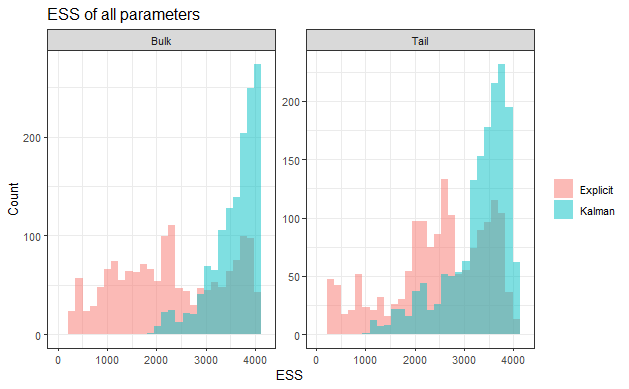
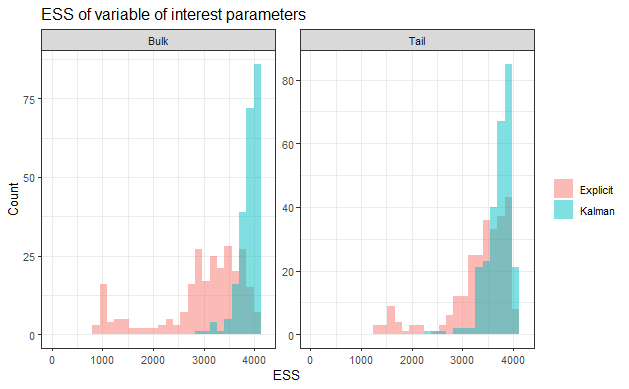

```{r setup, include=FALSE}
knitr::opts_chunk$set(echo = TRUE)
```

## Effective Sample Size

Given a univariate, stationary (discrete-time) Markov chain $X(t)$, let $\rho(t)$ denote the lag $t$ autocorrelation function, that is $\rho(t) = \frac{\text{Cov}(X(0),X(t))}{\text{Var}(X(0))}\,.$ Th effective sample size of a sample of $N$ draws of this chain is defined as
$$
N_{\text{eff}} = \frac{N}{1 + 2\sum_{t = 1}^{\infty}\rho(t)}\,.
$$
In practice, the autocorrelation function is estimated within-sample as $\hat{\rho}(t)$ and the sum appearing in the numerator in the defintion of $N_{\text{eff}}$ is truncated to some level $T \leq N$. In stan (@rstan), where $M$ chains are run, the autocorrelation of each element of the parameter vector $\mathbf{\theta}$ is estimated as a quantity pooled across chains, $\hat{\rho}(t)$. The effective sample size estimator is then given by
$$
N_{\text{eff}} = \frac{MN}{1 + 2\sum_{t = 1}^{2m + 1}\widehat{\rho}(t)}\,,
$$
for an integer $m$ chosen according to certain technical criteria (see https://mc-stan.org/docs/reference-manual/analysis.html#effective-sample-size.section). Notice that odd lags have been skipped in the sum to to ensure no anticorrelations and thus positivity of the estimate.

## EcoEnsemble warnings

### Sampling the quantity of interest

In EcoEnsemble, two sampling options are available in the main fitting function `fit_ensemble_model`. These are `sampler = kalman` and `sampler = explicit`. In each case, a sample of the posterior distribution of the parameters $\mathbf{\phi}$ is produced using the function `generate sample`. Given a fixed time series of length $T$ and a vector $\mathbf{u}^{(t)}$ associated to each time point $1 \leq t \leq T$, let $\mathbf{u}^{(1:T)} = (\mathbf{u}^{(1)\,'},\ldots,\mathbf{u}^{(T)\,'})'$ denote the stacked vector of each of these. To produce posterior samples of the quantity of interest $\mathbf{y}^{(1:T)}$ given the data $\mathbf{w}^{(1:T)}$, we seek
$$
p(\mathbf{y}^{(1:T)}\,|\,\mathbf{w}^{(1:T)}) = \int p(\mathbf{y}^{(1:T)}\,|\,\mathbf{w}^{(1:T)},\phi)p(\phi\,|\,\mathbf{w}^{(1:T)})\,.
$$
By MCMC we have access to a sample of size $MN$ for each element of $p(\phi\,|\,\mathbf{w}^{(1:T)})$. Then an efficient procedure (see @durbin_koopman) is followed to sample from the distribution of interest. For each sample $\phi_{i}$, sample a sequence of hidden states $\tilde{\mathbf{y}}^{(1:T)}$ from $p(\mathbf{y}^{(1:T)}\,|\,\phi)$ and a sequence of pseudo-observations $\tilde{\mathbf{w}}^{(1:T)}$ from $p(\mathbf{w}^{(1:T)}\,|\,\mathbf{y}^{(1:T)})$. Then $\tilde{\mathbf{y}}^{(1:T)}$ is a sample from the conditional distribution of $\mathbf{y}^{(1:T)}\,|\,\tilde{\mathbf{w}}^{(1:T)}$ and so has a multivariate normal distribution 
$$\tilde{\mathbf{y}}^{(1:T)} \sim \mathcal{N}(\mathbf{\mu}_{y\,|,\tilde{w}}, \Pi)$$
for some covariance matrix $\Pi$. Note that the conditional mean $\mathbf{\mu}_{y\,|,\tilde{w}}$ of the hidden state given the pseudo-data can be computed efficiently using a Kalman smoother. Since the joint posterior distribution of $\mathbf{y}^{(1:T)}\,,\,\mathbf{w}^{(1:T)}\,|\,\phi$ is multivariate normal, a standard result implies that the conditional distribution $\mathbf{y}^{(1:T)}\,,\,\mathbf{w}^{(1:T)}\,|\,\phi$ is also multivariate normal with a covariance matrix $\Pi$ that only depends on the size of $\mathbf{w}^{(1:t)}$, not the values. That is, 
$$\mathbf{y}^{(1:T)}\,,\,\mathbf{w}^{(1:T)}\,|\,\phi \sim \mathcal{N}(\mu_{y\,|,w}, \Pi)\,.$$
As in the case of the pseudo-observations, the posterior mean $\mu_{y\,|,w}$ can be computed by means of a backward Kalman smoother. As the same procedure was followed in the case of the pseudo-observations, we also have $\tilde{\mathbf{y}}^{(1:T)} - \mu_{y\,|\,\tilde{w}} \sim \mathcal{N}(\mathbf{0},\Pi)$. Hence 
$$\tilde{\mathbf{y}}^{(1:T)} - \mu_{y\,|\,\tilde{w}} + \mu_{y\,|,w} \sim \mathcal{N}(\mu_{y\,|,w}, \Pi)\,,$$
which is a sample from the posterior distribution we are interested in.

### Effective sample size of posterior of interest

Here we compare the minimal (across parameters) effective sample size per second achieved (excluding the warmup phase) between the two samplers, `sampler = kalman` and `sampler = explicit`. The effective sample size is computed per chain and then added across chains.

```{r, eval=FALSE}

fit <- fit_ensemble_model(observations = list(SSB_obs, Sigma_obs),
                                          simulators = list(list(SSB_ewe, Sigma_ewe, "EwE"),
                                                            list(SSB_lm,  Sigma_lm,  "LeMans"),
                                                            list(SSB_miz, Sigma_miz, "mizer"),
                                                            list(SSB_fs,  Sigma_fs,  "FishSUMS")),
                                          priors = priors,
                                          sampler = "kalman")

fit_explicit <- fit_ensemble_model(observations = list(SSB_obs, Sigma_obs),
                                          simulators = list(list(SSB_ewe, Sigma_ewe, "EwE"),
                                                            list(SSB_lm,  Sigma_lm,  "LeMans"),
                                                            list(SSB_miz, Sigma_miz, "mizer"),
                                                            list(SSB_fs,  Sigma_fs,  "FishSUMS")),
                                          priors = priors,
                                          sampler = "explicit")

ESS_fit <- get_ESS_diag(fit, only_voi = F)
ESS_fit_explicit <- get_ESS_diag(fit_explicit, only_voi = F)

plot_df <- rbind(
    data.frame(
        value = c(ESS_fit_explicit$ESS_bulk),
        metric = "Bulk",
        sampler = "Explicit"
    ),
    data.frame(
        value = c(ESS_fit$ESS_bulk),
        metric = "Bulk",
        sampler = "Kalman"
    ),
    data.frame(
        value = c(ESS_fit_explicit$ESS_tail),
        metric = "Tail",
        sampler = "Explicit"
    ),
    data.frame(
        value = c(ESS_fit$ESS_tail),
        metric = "Tail",
        sampler = "Kalman"
    )
)

ggplot(plot_df, aes(x = value, fill = sampler)) +
    geom_histogram(position = "identity", alpha = 0.5, bins = 30) +
    facet_wrap(~ metric, scales = "free") +
    labs(x = "ESS", y = "Count", fill = NULL)+
    xlim(0,4200)+
    theme_bw()+ggtitle("ESS of all parameters")

ESS_fit_voi <- get_ESS_diag(fit, only_voi = T)
ESS_fit_explicit_voi <- get_ESS_diag(fit_explicit, only_voi = T)

plot_df2 <- rbind(
    data.frame(
        value = c(ESS_fit_explicit_voi$ESS_bulk),
        metric = "Bulk",
        sampler = "Explicit"
    ),
    data.frame(
        value = c(ESS_fit_voi$ESS_bulk),
        metric = "Bulk",
        sampler = "Kalman"
    ),
    data.frame(
        value = c(ESS_fit_explicit_voi$ESS_tail),
        metric = "Tail",
        sampler = "Explicit"
    ),
    data.frame(
        value = c(ESS_fit_voi$ESS_tail),
        metric = "Tail",
        sampler = "Kalman"
    )
)

ggplot(plot_df2, aes(x = value, fill = sampler)) +
    geom_histogram(position = "identity", alpha = 0.5, bins = 30) +
    facet_wrap(~ metric, scales = "free") +
    labs(x = "ESS", y = "Count", fill = NULL)+
    xlim(0,4200)+
    theme_bw()+ggtitle("ESS of variable of interest parameters")

```

```{r, echo=F}

```
```{r,echo=F}

```

There are ESS warnings for these examples under the `explicit` sampler, but not the `kalman`. But these warnings should be disregarded, as they are concerning the parameters specific to the `explicit` sampling, and not the variable of interest. The first plot shows that the `explicit` sampler contains parameters with lower than the recommended 400 ESS (100 $*$ number of chains), whereas the `kalman` sampler has no ESS issues. When filtering down to the variable of interest, in this example the SSB over time, for all the parameters the ESS is greater than 400. Therefore, even though stan is giving us ESS warnings, we should not concern ourselves. 

# References


