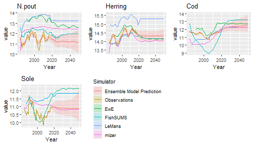
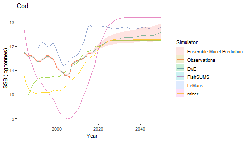
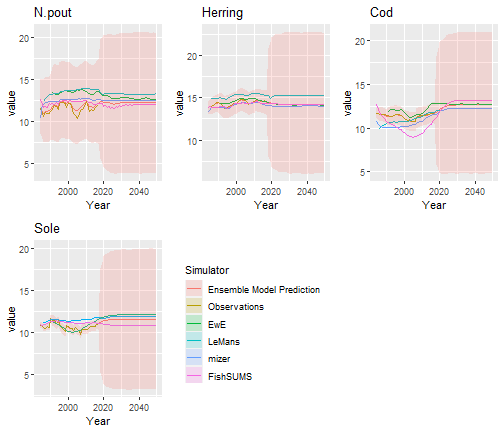

```{r include=FALSE}
#Load in the data and load the library
library(EcoEnsemble)
#load("data/vignette_plots.Rdata")
```

# Introduction
When managing ecosystems, management decisions are often informed by outputs of complex ecosystem models (henceforth referred to as simulators). There are often several such simulators available, each providing different outputs with potentially different implications for management actions. While some simulators are better at capturing some aspects of the ecosystem than others, in general no simulator is uniformly better than the others (@chandler), and often the average of simulators outperforms all of the simulators individually (@Rougier_16). 

Management decisions on the basis of a single simulator are therefore very sensitive to the choice of simulator ( @Collie_16, @Essington_13, @fulton_03, @Hart_fay, @Gaichas_08) and by ignoring other available simulators, we limit the amount of information utilised and increase our uncertainty (@spence_ff), often to a greater extent than we formally recognise.

Instead of choosing one simulator, it is possible to combine them using an ensemble model. However, many such methods, such as weighting schemes (e.g. Bayesian model averaging, @banner_higgs, @Dormann_18), explicitly assume that one of the simulators correctly describes the truth (@chandler). Not only is this a strong assumption, but treating a suite of simulators as containing the true model tends to underestimate the uncertainty because alternative, possibly as yet undeveloped, simulators could give predictions outside of the current range (@chandler). Under this scheme, adding a new simulator to the suite could increase the uncertainty of the ensemble despite the additional information contained in the new model (@Dormann_18). For an ensemble model with a robust quantification of uncertainty, uncertainty should decrease as simulators are added (or at worst stay the same).


@spence_ff developed an ensemble model treating individual simulators as exchangeable and drawn from a population of possible simulators. They separated each individual simulator's discrepancy into a discrepancy shared between the simulators and discrepancy that is specific to the simulator. This scheme  allows simulator discrepancies that are not independent, which is expected since individual simulator are often similar, having similar processes, forcing inputs or fitted using similar data (@rougier_13). By modelling in this way, the ensemble model exploits the strengths whilst discounting the weaknesses of each individual simulator (@chandler), whilst robustly quantifying the uncertainty allowing for more accurate advice.

`EcoEnsemble` is an `R` package that implements the ensemble model of @spence_ff when the simulators either output the quantity of interest or not.

# Model description

At time $t$, the true quantity of interest for $d$ variables, $\mathbf{y}^{(t)}=(y_1^{(t)},\ldots,y_d^{(t)})'$, is described by $m$ simulators, $\mathbf{\hat{x}}_{k}^{(t)}=(\hat{x}_{k,1}^{(t)},\ldots,\hat{x}_{k,n_k}^{(t)})'$, with $n_k$ outputs each relating to one of the variables of interest, for $k=1,\ldots,m$, and noisy observations of the variables of interest, $\hat{\mathbf{y}}^{(t)}=(\hat{y}_1^{(t)},\ldots,\hat{y}_d^{(t)})'$.

Not all of the simulators output all the variables over the whole time period. 
To accommodate these differences, @spence_ff introduced a latent variable, known as the "best guess", $\mathbf{x}_{k}^{(t)}=({x}_{1}^{(t)},\ldots,{x}_{d}^{(t)})'$, which represents simulator $k$'s output if it described all $d$ variables at time $t$ with no parameter uncertainty. In `EcoEnsemble`, variables of interest are either present or absent in each simulator, therefore if the $k$th simulator was evaluated at time $t$, its output is
$$
\mathbf{\hat{x}}_{k}^{(t)}\sim{}N(M_k^{(t)}\mathbf{x}_{k}^{(t)},\Sigma_k),
$$
where $M_k^{(t)}$ is an $n_k\times{}d$ matrix and $\Sigma_k$ reflects the parameter uncertainty of the $k$th simulator.

The true values of the variables of interest at time $t$ is simulator $k$'s "best guess" plus a discrepancy term, $\mathbf{\zeta}^{(t)}_k$, @kennedy_ohagan, i.e. 
$$
\mathbf{y}^{(t)} =  \mathbf{x}_{k}^{(t)} + \mathbf{\zeta}^{(t)}_k.
$$
The discrepancy term, $\mathbf{\zeta}^{(t)}_k$, is split between discrepancies that are shared between all of the simulators, and discrepancies that were specific to the $k$th simulator. These two discrepancies are further split into fixed discrepancies, the long-term shared discrepancy, $\mathbf\delta$, and simulator $k$'s long-term individual discrepancy, $\mathbf\gamma_k$, and dynamic discrepancies, the short-term shared discrepancy, $\mathbf\eta^{(t)}$, and simulator $k$'s short-term individual discrepancy, $\mathbf{z}_k^{(t)}$, i.e.
$$
\mathbf{\zeta}^{(t)}_k = \mathbf\delta + \mathbf\eta^{(t)} + \mathbf\gamma_k + \mathbf{z}_k^{(t)}.
$$
The long-term individual discrepancy for the $k$th simulator is
$$
    \mathbf{\gamma}_k\sim{}N(\mathbf{0},C_{\gamma}).
$$
The short-term discrepancy terms, $\mathbf\eta^{(t)}$ and $\mathbf{z}_k^{(t)}$, follow an auto-regressive processes of order one,
$$
\mathbf{\eta}^{(t)}\sim{}N(R_{\eta}\mathbf{\eta}^{(t-1)},\Lambda_{\eta})
$$
and
$$
\mathbf{z}_{k}^{(t)}\sim{}N(R_{k}\mathbf{z}_{k}^{(t-1)},\Lambda_{k})
$$
respectively, where the diagonal elements of $R_i,  (i = \eta, 1, 2, \ldots, m )$ are between $-1$ and $1$, and the off-diagonal elements are $0$.


In the absence of any other information, the true variables evolve according to a random walk,
$$
\mathbf{y}^{(t)}\sim{}N(\mathbf{y}^{(t-1)},\Lambda_y),
$$
with noisy observations,
$$
\mathbf{\hat{y}}^{(t)}\sim{}N(\mathbf{y}^{(t)},\Sigma_y),
$$
when there are observations at time $t$.

## Dynamic linear model
The ensemble model can be written as a dynamical linear model, by letting
\begin{equation}
\mathbf\theta^{(t)}=(\mathbf{y}^{(t)'},\mathbf\eta^{(t)'},\mathbf{z}_1^{(t)'},\ldots,\mathbf{z}_m^{(t)'})',
\end{equation}
so that
\begin{equation}
\mathbf\theta^{(t)}|\mathbf\theta^{(t-1)}\sim{}N(A\mathbf\theta^{(t)},\Lambda),
\end{equation}
with
\begin{equation}
A= 
\begin{pmatrix}
I_d & 0 & 0 & 0 & \ldots & 0\\
0 & R_\eta & 0 & 0 & \ldots & 0\\
0  & 0 & R_1  & 0 & \ldots & 0\\
0  & 0 & 0 & R_2  & \ldots & 0\\
\vdots & \vdots & \vdots & \vdots & \ddots & \vdots \\
0  &  0 & 0 & 0 & \ldots & R_m
\end{pmatrix},
\end{equation}
with $I_d$ being a $d$ dimensional indicator matrix,
and
\begin{equation}
\Lambda=
\begin{pmatrix}
\Lambda_y & 0 & 0 & 0 & \ldots & 0\\
0 & \Lambda_\eta & 0 & 0 & \ldots & 0\\
0  & 0 & \Lambda_1  & 0 & \ldots & 0\\
0  & 0 & 0 & \Lambda_2  & \ldots & 0\\
\vdots & \vdots & \vdots & \vdots & \ddots & \vdots \\
0  &  0 & 0 & 0 & \ldots & \Lambda_m
\end{pmatrix}.
\end{equation}
The observations
\begin{equation}
\mathbf{w}^{(t)}=(\mathbf{\hat{y}}^{(t)'},\mathbf{\hat{x}}^{(t)'}_1,\ldots,\mathbf{\hat{x}}^{(t)'}_m)'
\end{equation}
are 
\begin{equation}
S^{(t)}\mathbf{w}^{(t)}\sim{}N(S^{(t)}B(\mathbf{\theta} + \mathbf\zeta),S^{(t)}\Sigma^{(t)}S^{(t)'})
\label{eq:DLM_obs}
\end{equation}
where
\begin{equation}
B= 
\begin{pmatrix}
I_d & 0 & 0 & 0 & \ldots & 0\\
M_1 & M_1 & M_1  & 0 & \ldots & 0\\
M_2  & M_2 & 0 & M_2  & \ldots & 0\\
\vdots & \vdots & \vdots & \vdots & \ddots & \vdots \\
M_m  &  M_m & 0 & 0 & \ldots & M_m
\end{pmatrix},
\end{equation}
\begin{equation}
\mathbf\zeta=(\mathbf{0}',\mathbf{\delta}',\mathbf\gamma'_1,\ldots,\mathbf\gamma'_m)',
\end{equation}
with
$\mathbf{0}$ being a $d$ dimensional vector of 0s,
\begin{equation}
\Sigma=
\begin{pmatrix}
\Sigma_y & 0  & \ldots & 0\\
0 & \Sigma_1 &   \ldots & 0\\
\vdots & \vdots  & \ddots & \vdots \\
0  &  0  & \ldots & \Sigma_m
\end{pmatrix}
\end{equation}
and $S^{(t)}$ is a matrix that is used to describe which variables are observed at time $t$. The $S^{(t)}$ matrix is an $r(t) \times \left(d + \sum_{k=1}^m n_k\right)$ matrix, where $r(t)$ is the total number of observations and simulator outputs available at time $t$, with each element given by 
$$
S^{(t)}_{i, j} = 
\begin{cases}
  1 & \mathrm{if\ the \ }i^{th} \mathrm{\ available\ observation\ /\ model\ output\ is\ the\ }j^{th}\mathrm{\ of\ all\ possible\ observation\ /\ model\ outputs.} \\
  0 & \mathrm{otherwise}
\end{cases}
$$

For example, if all observations and the simulators give an output at time $t$ then $S^{(t)}=I_{d+\sum_{k=1}^{m}n_k}$. If all   simulators output the variables of interest but there are no observations then $S^{(t)}$ is a  $\left(\sum_{k=1}^m n_k\right) \times \left(d + \sum_{k=1}^m n_k\right)$ matrix, equal to $I_{d+\sum_{k=1}^{m}n_k}$ with the first $d$ rows removed.


# Dataset for the North Sea
We demonstrate the ensemble model by investigating what would happen to the spawning stock biomass (SSB) of four species in the North Sea ($d=4$), Norway pout *(Trisopterus esmarkii)*, Atlantic herring *(Clupea harengus)*, Atlantic cod *(Gadus morhua)*, and Common sole *(Solea solea)*. We used four simulators and estimates of SSB from single-species assessments to predict the true SSB from 1984 to 2017, and the SSB from 2018 to 2050 under MSY.


## Observations
Noisy observations of the SSB were taken from single-species stock assessments (@ices_ns, @ices_hawg). The uncertainty is species specific so the off diagonal elements of $\Sigma_y$ are zero and the diagonal elements are calculated from the uncertainty in the stock assessments. These values, and the associated uncertainty are contained in the `SSB_obs` and `Sigma_obs` variables. The `SSB_obs` data frame contains a row for each year, with a column for each species observed. Note that for `EcoEnsemble`, the rows and columns of all observations and model outputs must be named appropriately in order for the data transformations to behave correctly.
```{r label="Observations"}
SSB_obs
Sigma_obs
```

## Simulators

**EcoPath with EcoSim** (EwE) is an ecosystem model with 60 functional groups for the North Sea (@ices_ewe). It outputs all four species from 1991 until 2050, in the variable `SSB_ewe`, meaning that $n_1=4$ and $M_1=I_4$.
The covariance of the EwE's output, $\Sigma_{1}$, was calculated in @mackinson and is stored in the variable `Sigma_ewe`,

```{r label="EwESigma"}
Sigma_ewe
```


**LeMans** is a discrete time length-based model that describes growth and predation (@thorpe15). It outputs all four species from 1986 until 2050, in the variable `SSB_lm`, meaning that $n_2=4$ and $M_2=I_4$.
The covariance of the LeMans' output, $\Sigma_{2}$, was calculated in @thorpe15 and is stored in the variable `Sigma_lm`,

```{r label="lmSigma"}
Sigma_lm
```


**mizer** is a size-based model that describes ontogenetic feeding and growth, mortality, and reproduction driven by size-dependent predation and maturation processes (@blanchard). It outputs all four species from 1984 until 2050, in the variable `SSB_miz`, meaning that $n_3=4$ and $M_3=I_4$.
The covariance of the mizer's output, $\Sigma_{3}$, was calculated in @spence_ns and is stored in the variable `Sigma_miz`,

```{r label="mizSigma"}
Sigma_miz
```


**FishSUMS** is a discrete time length-based model that describes growth, density-dependent mortality, and losses due to fishing and predation by explicitly modelled species, and seasonal reproduction (@fishsums). It outputs Norway pout, Atlantic Herring, and Atlantic Cod (i.e. it does not output Sole), from 1984 until 2050, in the variable `SSB_fs`, meaning that $n_4=3$ and
\begin{equation}
    M_4=
    \begin{pmatrix}
    1 & 0 &  0 & 0\\
    0 & 1  & 0 & 0\\
    0 & 0 & 1 & 0 
    \end{pmatrix}.
\end{equation}


The covariance of the FishSUMS' output, $\Sigma_{4}$, was calculated in @spence_ff and is stored in the variable `Sigma_fs`. Its value is


```{r label="fsSigma"}
Sigma_fs
```

The single-species stock assessments for the 4 species, along with the model outputs are plotted below. 


```{r model_outputs, warning=FALSE, fig.dim = c(7, 3), message = FALSE, echo = FALSE}
library(tibble)
library(dplyr)
library(reshape2)
library(ggplot2)

#Inlcude years in the data frames
SSB_obs_tmp <- rownames_to_column(SSB_obs, var = "Year")
SSB_ewe_tmp <- rownames_to_column(SSB_ewe, var = "Year")
SSB_miz_tmp <- rownames_to_column(SSB_miz, var = "Year")
SSB_lm_tmp <- rownames_to_column(SSB_lm, var = "Year")
SSB_fs_tmp <- rownames_to_column(SSB_fs, var = "Year")

#Join dataframes together
df_all <- SSB_obs_tmp %>% 
    full_join(SSB_ewe_tmp, by = "Year", suffix = c("","_ewe")) %>%
    full_join(SSB_miz_tmp, by = "Year", suffix = c("","_miz")) %>%
    full_join(SSB_lm_tmp, by = "Year", suffix = c("","_lm")) %>%
    full_join(SSB_fs_tmp, by = "Year", suffix = c("","_fs"))

#Melt into long data format for ggplot
df_all <- melt(df_all, id.vars = "Year")
colnames(df_all) <- c("Year", "Simulator", "logSSB")
df_all$Year <- as.numeric(df_all$Year)

#Finally create the plots
df_n_pout <- df_all[grepl("N.pout", df_all$Simulator), ]
p1 <- ggplot(data=df_n_pout, aes(x=`Year`, y=`logSSB`, na.rm = TRUE)) + 
  geom_line(aes(group=`Simulator`,colour=`Simulator`)) +
  ggtitle("Norway pout")

df_herring <- df_all[grepl("Herring", df_all$Simulator), ]
p2 <- ggplot(data=df_herring, aes(x=`Year`, y=`logSSB`, na.rm = TRUE)) +    
  geom_line(aes(group=`Simulator`,colour=`Simulator`)) + 
  ggtitle("Herring")

df_cod <- df_all[grepl("Cod", df_all$Simulator), ]
p3 <- ggplot(data=df_cod, aes(x=`Year`, y=`logSSB`, na.rm = TRUE)) +    
  geom_line(aes(group=`Simulator`,colour=`Simulator`))+
  ggtitle("Cod")

df_sole <- df_all[grepl("Sole", df_all$Simulator), ]
p4 <- ggplot(data=df_sole, aes(x=`Year`, y=`logSSB`, na.rm = TRUE)) +    
  geom_line(aes(group=`Simulator`,colour=`Simulator`)) +
  ggtitle("Sole")

cowplot::plot_grid(p1, p2, p3, p4, ncol = 2, nrow = 2)

```

# Fitting the model
## Prior configuration

In `EcoEnsemble`, short-term discrepancies ($\mathbf{z_k^{(t)}}, \mathbf{\eta^{(t)}}$) are modelled using auto-regressive processes of order one, so that 
\begin{align}
    \mathbf{z}_{k}^{(t)} & \sim{}N(R_{k}\mathbf{z}_{k}^{(t-1)},\Lambda_{k}), \\
    \mathbf{\eta}^{(t)}& \sim{}N(R_{\eta}\mathbf{\eta}^{(t-1)},\Lambda_{\eta}). 
\end{align}
Note also that the long-term individual discrepancies ($\mathbf{\gamma}_k$) are drawn from a normal distribution 
\begin{equation}
    \mathbf{\gamma}_k  \sim{}N(\mathbf{0},C_{\gamma}). \\
\end{equation}

To include prior beliefs in the ensemble model, we therefore need to place priors on $m+2$ different covariance matrices - $\Lambda_{1}, \Lambda_2, \ldots \Lambda_m, \Lambda_{\eta}, C_\gamma$. In `EcoEnsemble`, the choice of prior parametrisations is the same for all of these matrices, however it should be noted that the interpretation of each is different. In particular, the $\Lambda$ matrices are covariances of a dynamic auto-regressive process across time, while $C_\gamma$ is the covariance of the distribution of static long-term discrepancies across different simulators.

In `EcoEnsemble`, we follow the approach of @spence_ff and decompose the covariance matrices into correlation matrices and a diagonal matrix of variances, i.e.  

\begin{equation}
    \Lambda = \sqrt{\mathrm{diag}(\mathbf{\pi})}  P \sqrt{\mathrm{diag}(\mathbf{\pi})},
\end{equation}
where $\mathbf{\pi}$ is the vector of variances of each species, and $P$ is the correlation matrix. Here we write $\Lambda$ for any of $\Lambda_k, \Lambda_\eta, C_\gamma$.


There are three available prior parametrisations for covariance matrices. In each case, the variance terms are parametrised by inverse-gamma distributions, while the correlation matrices can be parametrised either by an LKJ distribution, an inverse-wishart distribution, or by Beta distributions.

Configuring these options in `EcoEnsemble` package is most easily done using the `EnsemblePrior` constructor. A set of default priors is available which produce weakly informative priors that hold for a wide range of different datasets. We can set

``` {r}
#Setting priors for an ensemble model with 4 variables of interest.
priors <- EnsemblePrior(4)
```

If desired, priors can be manually configured for finer control, for example we can set 

``` {r}
priors_custom <- EnsemblePrior(
                        d = 4,
                        ind_st_params = IndSTPrior("lkj", list(25, 0.25), 30),
                        ind_lt_params = IndLTPrior(
                          "beta",
                          list(c(25, 25, 25, 10),c(0.25, 0.25, 0.25, 0.1)),
                          list(matrix(40, 4, 4), matrix(40, 4, 4))
                          ),
                        sha_st_params = ShaSTPrior("lkj", list(25, 0.25), 30),
                        sha_lt_params = 3)
```

This is:

* `ind_st_params` - The individual short-term discrepancies $\mathbf{z}_{k}^{(t)}$. `IndSTPrior("lkj", list(25, 0.25), 30)` encodes that we use $\mathrm{\text{Gamma}(25, 0.25)}$ priors for the variances of all species and an $LKJ(30)$ prior on the correlation matrix.
* `ind_lt_params` - The individual long-term discrepancies $\mathbf{\gamma_k}$ use an $\mathrm{\text{Gamma}(25, 0.25)}$ prior for the variances of the first 3 species and an $\mathrm{\text{Gamma}(10, 0.1)}$ prior for the variance of the final species. The correlation matrix uses a $\mathrm{Beta}(40, 40)$ distribution for each of the off-diagonal elements.
* `sha_st_params` - The shared short-term discrepancies $\mathbf{\eta}^{(t)}$ use $\mathrm{\text{Gamma}(25, 0.25)}$ priors for variances of all species and an $LKJ(30)$ prior on the correlation matrix.
* `sha_lt_params` - Unlike the other discrepancies, the shared long-term discrepancy $\mathbf{\mu}$ is not decomposed into correlation matrices and variances. Instead, a Gaussian distribution is used as the prior on each of the species. `sha_lt_params` encodes that the standard deviation of this Gaussian prior is `3`.


## Model fitting

The ensemble model parameters are fit using the `fit_ensemble_model` function, which converts the data into the required form. Hamiltonian Monte Carlo then samples from the posterior distribution using the `rstan` package @rstan. A sample of the ensemble parameters can then be generated using the `generate_sample` function.

```{r, label = "fit", eval=FALSE}
fit_sample <- fit_ensemble_model(observations = list(SSB_obs, Sigma_obs),
                                 simulators = list(list(SSB_ewe, Sigma_ewe, "EwE"),
                                                   list(SSB_lm,  Sigma_lm,  "LeMans"),
                                                   list(SSB_miz, Sigma_miz, "mizer"),
                                                   list(SSB_fs,  Sigma_fs,  "FishSUMS")),
                                 priors = priors)
samples <- generate_sample(fit_sample)
```

Note that for the simulators, we pass through the name of the simulators as the third argument. This is not required, however provides more accurate error messages and appropriately labeled plots when needed.


## Results

Results can be shown by calling `plot` on an `EnsembleSample` object. This plots the observations, simulator outputs, and the ensemble model prediction for the truth for each of the variables of interest. The ensemble model prediction also shows ribbons for the quantiles if a full sampling is performed (by default these are the 5% and 95% quantiles).
``` {r, label = "Initial_plots", eval=FALSE}
plot(samples)
```
```{r fig.dim = c(7, 4), echo=FALSE, warning = FALSE}

```


We can change which variable we plot by passing through a `variable` option, and are free to change the aesthetics in the same way as other `ggplot2` plots, see the ggplot manual @ggplot. Different quantiles can also be specified with the quantiles option, e.g.

```{r, label = "Initial_plots_changed", fig.dim = c(7, 4), eval=FALSE}
plot(samples, variable = "Cod", quantiles = c(0.25, 0.75)) + 
    ggplot2::theme_classic() + 
    ggplot2::scale_color_brewer(palette="Set2")  +
    ggplot2::ylab("SSB (log tonnes)")
```
```{r fig.dim = c(7, 4), echo=FALSE, warning = FALSE}

```


# Case Studies

## Visualising priors

Priors can be visualised using the `prior_ensemble_model()` function and/or the `sample_prior()` function. These models are quick to evaluate and indicate what restrictions the priors place on the ensemble outputs, for example using the priors from the previous section.
```{r visualise_priors, eval= FALSE}
prior_model <- prior_ensemble_model(priors = priors, M = 4)
prior_samples <- sample_prior(observations = list(SSB_obs, Sigma_obs),
                                 simulators = list(list(SSB_ewe, Sigma_ewe, "EwE"),
                                                   list(SSB_lm,  Sigma_lm,  "LeMans"),
                                                   list(SSB_miz, Sigma_miz, "mizer"),
                                                   list(SSB_fs,  Sigma_fs,  "FishSUMS")),
                                 priors = priors, prior_model)

```
The `sample_prior()` function produces an `EnsembleSample` object which can be plotted in the same way as other `EnsembleSample` objects.

```{r plot_priors, fig.dim = c(7, 4), eval = FALSE}
plot(prior_samples)
```
```{r fig.dim = c(7, 6), echo = FALSE, warning = FALSE}

```


## Finer fitting control
Using the wrapper functions `fit_ensemble_model, generate_sample` is the easiest way to generate samples from the ensemble model. However, for finer control, the model can be fit directly with `rstan`. To create data in the correct form of the model, simply create an `EnsembleData` object using the constructor.

```{r, label = "create_data_manual"}
ens_data <- EnsembleData(observations = list(SSB_obs, Sigma_obs),
                          simulators = list(list(SSB_ewe, Sigma_ewe, "EwE"),
                                            list(SSB_lm,  Sigma_lm,  "LeMans"),
                                            list(SSB_miz, Sigma_miz, "mizer"),
                                            list(SSB_fs,  Sigma_fs,  "FishSUMS")),
                          priors = priors)

```
The `EnsembleData` object has 4 slots: `observations`, `simulators`, `priors`, and `stan_input`. The first 3 slots are the data as passed through in the constructor. The `stan_input` slot is automatically generated by transforming the other data into the form required for the Stan implementation of the ensemble model. To fit the model, the compiled `rstan` object can be retrieved through the `get_mcmc_ensemble_model()` method.

```{r, label = "fitting_ensemble_DIY", eval=FALSE}
mod <- get_mcmc_ensemble_model()
samples <- rstan::sampling(mod, data = ens_data@stan_input)
fit <- EnsembleFit(ens_data, samples = samples)
```
To generate individual samples of the ensemble parameters with this output, now call the `get_transformed_data` and `gen_sample` functions:

``` {r, eval = FALSE}
# Generating samples using DIY functions
transf_data <- get_transformed_data(fit)
mle_sample <- gen_sample(1, ex.fit = rstan::extract(samples), transformed_data = transf_data,
                         time = ens_data@stan_input$time)
```

The equivalent code using wrapper functions:
```{r, eval=FALSE}
fit <- fit_ensemble_model(observations = observations, simulators = simulators,
                          priors = priors)
samples_tmp <- generate_sample(fit)
samples <- samples_tmp@samples
```


# References
