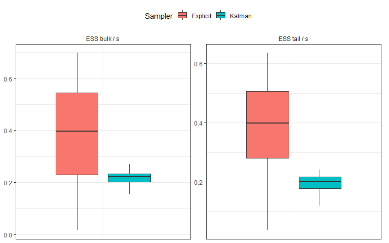
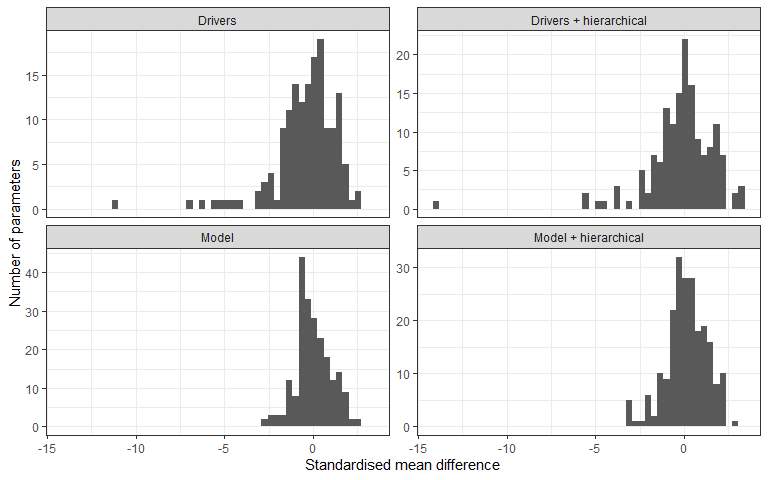
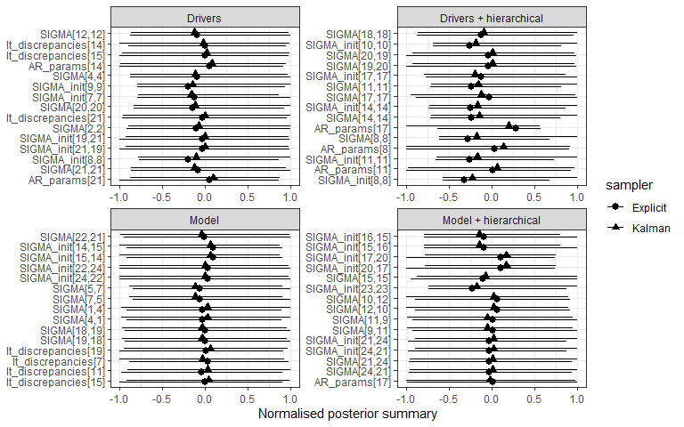

```{r, include = FALSE}
knitr::opts_chunk$set(
  collapse = TRUE,
  comment = "#>",
  warning = FALSE,
  message = FALSE,
  fig.width = 8,
  fig.height = 5
)

library(ggplot2)
library(dplyr)
library(knitr)
library(kableExtra)

pair_results  <- readRDS("data/pair_results.rds")
plot_df2       <- readRDS("data/plot_df2.rds")
table_diag    <- readRDS("data/table_diag.rds")
section_sizes <- readRDS("data/section_sizes.rds")
diag_table    <- readRDS("data/diag_table.rds")
plot_df_ess <- readRDS("data/plot_df_ess.rds")
```

```{r setup, include=FALSE}
library(EcoEnsemble)
```

# Summary
-
This document describes an option in `EcoEnsemble (V1.2.0)` that samples the latent states ($$ {\boldsymbol{\theta}}^{(t)}={\left({\boldsymbol{y}}^{(t)^{\prime }},{\boldsymbol{\eta}}^{(t)^{\prime }},{\boldsymbol{z}}_1^{(t)^{\prime }},\dots, {\boldsymbol{z}}_m^{(t)^{\prime }}\right)}^{\prime } $$) explicitly alongside the model parameters, hereafter referred to as the `explicit` approach, rather than integrating the latent states out of the likelihood using the [Kalman filter](EcoEnsemble.html).

By default, the `explicit` option is chosen within `fit_ensemble_model`, to retain the `kalman` sampler, the argument may be changed. 

```{r, eval=F}
#generate priors
priors <- EnsemblePrior(4)

#run the model
fit_sample <- fit_ensemble_model(observations = list(SSB_obs, Sigma_obs),
                                 simulators = list(list(SSB_ewe, Sigma_ewe, "EwE"),
                                                   list(SSB_lm,  Sigma_lm,  "LeMans"),
                                                   list(SSB_miz, Sigma_miz, "mizer"),
                                                   list(SSB_fs,  Sigma_fs,  "FishSUMS")),
                                 priors = priors,
                                 sampler = "kalman")
```

The main motivation for this change is improved computational efficiency. Below, bulk and tail effective sample size per second (ESS/s) are compared between the `explicit` and `kalman` options, for the hierarchical model. The ESS shown here is computed for the latent state, `SSB`.

```{r, echo=F, out.width = "75%",fig.align ='center'}

# ggplot2::ggplot(plot_df_ess %>%
#     dplyr::filter(setup == "Model + hierarchical") %>%
#     dplyr::mutate(sampler = dplyr::if_else(sampler == "E", "Explicit", sampler))%>%mutate(sampler = dplyr::if_else(sampler == "K", "Kalman", sampler))
#                 , ggplot2::aes(x = setup, y = value, fill = sampler)) +
#   ggplot2::geom_boxplot(
#     position = ggplot2::position_dodge(width = 0.72),
#     width = 0.58,
#     outlier.shape = NA
#   ) +
#   ggplot2::facet_wrap(metric ~ ., scales = "free_y", nrow=1) +
#   ggplot2::labs(
#     x = NULL,
#     y = NULL,
#     fill = "Sampler"
#   ) +
#   ggplot2::theme_bw(base_size = 11) +
#   ggplot2::theme(
#     legend.position = "top",
#     strip.placement = "outside",
#     strip.background = ggplot2::element_blank(),
#     panel.spacing.y = grid::unit(0.15, "lines"),
#     plot.margin = grid::unit(c(0.3, 0.4, 0.2, 0.2), "cm")
#   )+ ggplot2::theme(
#     axis.title.x = ggplot2::element_blank(),
#     axis.text.x  = ggplot2::element_blank(),
#     axis.ticks.x = ggplot2::element_blank()
#   )



```

In this example the `explicit` option is much faster while sampling from the same distribution as the `kalman` approach. Using this new option results in faster ESS/s and shorter run-times, but may require more iterations as there is generally lower ESS per run.  


# Equivalence of the samplers

Let $\mathbf{\phi}$ be a vector containing the fixed parameters, specifically the (vectorised) covariance matrices, the (vectorised) AR(1) parameter matrices as well as the shared long-term discrepancy $\delta$:
$$
\mathbf{\phi} = (\Lambda_{1},\Lambda_{2},\ldots,\Lambda_{m},\Lambda_{\eta},\Lambda_{y},C_{\gamma},R_{1}, R_{2},\ldots R_{m},R_{\eta},\mathbf{\delta})\,.
$$
If we have a time series of length $T$, the aim is to fit these parameters given the data $\mathbf{w}^{(1)},\mathbf{w}^{(2)},\ldots,\mathbf{w}^{(T)}$. When the option `sampler = "explicit"` is chosen in `fit_ensemble_model`, the sampler generates samples from the distribution
 
$$
p(\mathbf{\phi},\mathbf{\theta}^{(1)},\ldots,\mathbf{\theta}^{(T)}\,|\,\mathbf{w}^{(1)},\mathbf{w}^{(2)},\ldots,\mathbf{w}^{(T)})\,.
$$
A sample from the posterior of $\mathbf{\phi}$ is then produced by simple marginalisation
 
$$
p(\mathbf{\phi}\,|\,\mathbf{w}^{(1)},\ldots,\mathbf{w}^{(T)}) = \int p(\mathbf{\phi},\mathbf{\theta}^{(1)},\ldots,\mathbf{\theta}^{(T)}\,|\,\mathbf{w}^{(1)},\mathbf{w}^{(2)},\ldots,\mathbf{w}^{(T)}) \,d\mathbf{\theta}^{(1)}\cdots d\mathbf{\theta}^{(T)}\,.
$$
Alternatively, directly sampling from the joint distribution of $\mathbf{\phi}$ and $\mathbf{\theta}^{(1)},\ldots,\mathbf{\theta}^{(T)}$ can be avoided by noting that
 
$$
\begin{split}
&p(\mathbf{\phi}\,|\,\mathbf{w}^{(1)},\ldots,\mathbf{w}^{(T)}) = \int p(\mathbf{\phi},\mathbf{\theta}^{(1)},\ldots,\mathbf{\theta}^{(T)}\,|\,\mathbf{w}^{(1)},\mathbf{w}^{(2)},\ldots,\mathbf{w}^{(T)}) \,d\mathbf{\theta}^{(1)}\cdots d\mathbf{\theta}^{(T)}\\
&\propto \int p(\mathbf{w}^{(1)},\mathbf{w}^{(2)},\ldots,\mathbf{w}^{(T)}\,|\,\mathbf{\phi},\mathbf{\theta}^{(1)},\ldots,\mathbf{\theta}^{(T)})p(\mathbf{\phi},\mathbf{\theta}^{(1)},\ldots,\mathbf{\theta}^{(T)}) \,d\mathbf{\theta}^{(1)}\cdots d\mathbf{\theta}^{(T)}\\
&=p(\mathbf{\phi})\int \bigg(\prod_{t = 1}^{T}p(\mathbf{w}^{(t)}\,|\,\mathbf{\phi},\mathbf{\theta}^{(t)})\bigg)\bigg(\prod_{t = 1}^{T - 1}p(\mathbf{\theta}^{(t + 1)}\,|\,\mathbf{\phi},\mathbf{\theta}^{(t)})\bigg)p(\mathbf{\theta}^{(1)}\,|\,\mathbf{\phi})\,d\mathbf{\theta}^{(1)}\cdots d\mathbf{\theta}^{(T)}\\
&= p(\mathbf{\phi})\int \bigg(\prod_{t = 1}^{T-1}p(\mathbf{w}^{(t + 1)}\,|\,\mathbf{\phi},\mathbf{\theta}^{(t + 1)})p(\mathbf{\theta}^{(t + 1)}\,|\,\mathbf{\phi},\mathbf{\theta}^{(t)})\bigg)p(\mathbf{\theta}^{(1)}\,|\,\mathbf{\phi})p(\mathbf{w}^{(1)}\,|\,\mathbf{\phi},\mathbf{\theta}^{(1)})\,d\mathbf{\theta}^{(1)}\cdots d\mathbf{\theta}^{(T)}\,.\\
\end{split}
$$
The integral can be evaluated iteratively using the Kalman filter and the fixed parameters $\mathbf{\phi}$ can be sampled using MCMC. 

#Output

The four currently available configurations of a `EcoEnsemble` model are tested with the new `explicit` option against the `kalman` option. The runs used the *non-hierarchical model*, specified by `lkj` priors, the *hierarchical model*, specified by `hierarchical` priors, the *drivers model* and the *hierarchical drivers model*, both specified by `drivers = T`.  Code and data is taken from the vignettes, [IncludingDrivers](IncludingDrivers.html) and [EcoEnsemble](EcoEnsemble.html).

## Posterior Comparison

The plot below compares posterior summaries between the `explicit` and `kalman` options It shows the difference in posterior means, standardised by the pooled Monte Carlo standard error. The comparison is restricted to the shared state-space parameters used in posterior state reconstruction.

```{r, echo=F, out.width = "85%",fig.align ='center'}
# ggplot(pair_results, aes(x = z_mean)) +
#   geom_histogram(bins = 50) +
#   facet_wrap(~ pair, scales = "free_y") +
#   labs(
#     x = "Standardised mean difference",
#     y = "Number of parameters"
#   )+theme_bw()



```

The 15 parameters with the greatest differences are plotted below.

```{r, echo=F, out.width = "85%",fig.align ='center'}
# ggplot(plot_df2, aes(y = variable, x = mean_n, xmin = q5_n, xmax = q95_n, shape = sampler)) +
#   geom_pointrange(position = position_dodge(width = 0.5)) +
#   facet_wrap(~ pair, scales = "free") +
#   labs(x = "Normalised posterior summary", y = NULL)+theme_bw()



```

There are no considerable differences in the output between the `explicit` or `kalman` sampler.

## Performance

The main difference between is computational efficiency. The table below summarises the speed increase of the `explicit` over the `kalman` option. ESS is per second spent sampling, discarding the burn-in time.  

```{r, echo=F}
table_diag %>%
    select(-section) %>%
    mutate(across(where(is.numeric), ~ formatC(., format = "fg", digits = 3))) %>%
    kbl(
        booktabs = TRUE,
        align = c("l", rep("r", 8)),
        col.names = c("Diagnostic", "E", "K", "E", "K", "E", "K", "E", "K")
    )  %>%
    add_header_above(c(
        " " = 1,
        "Drivers" = 2,
        "Model" = 2,
        "Model + hierarchical" = 2,
        "Drivers + hierarchical" = 2
    )) %>%
    kable_styling(
        full_width = FALSE,
        font_size = 10,
        latex_options = "hold_position"
    ) %>%
    row_spec(0, bold = TRUE) %>%
    pack_rows("Run time", 1, section_sizes["Run time"]) %>%
    pack_rows(
        "Convergence",
        section_sizes["Run time"] + 1,
        section_sizes["Run time"] + section_sizes["Convergence"]
    ) %>%
    pack_rows(
        "Bulk diagnostics",
        section_sizes["Run time"] + section_sizes["Convergence"] + 1,
        section_sizes["Run time"] + section_sizes["Convergence"] + section_sizes["Bulk diagnostics"]
    ) %>%
    pack_rows(
        "Tail diagnostics",
        section_sizes["Run time"] + section_sizes["Convergence"] + section_sizes["Bulk diagnostics"] + 1,
        sum(section_sizes)
    ) %>%
    column_spec(1, width = "4.2cm") %>%
    column_spec(2:9, width = "1.5cm")

```

Between the two options, `explicit` results in a lower ESS for each model configuration, but `kalman` has a lower ESS per second. ESS per run is higher for `kalman` in the non-drivers cases, meaning that it has a higher ESS for a given number of iterations. So in the `explicit` case, further iterations may be necessary to achieve the same ESS. Regardless, the run time for both the sampling and the warm-up is much faster for the `explicit` sampler. The pattern seen is not different between the bulk and tail ESS.

# Sampler Warnings

The two options induce different posterior geometries, so the stan No-U-Turn Sampler's diagnostics can differ. The table below summarises the Stan diagnostics for each model formulation.

```{r, echo=F}
diag_table %>%
    mutate(across(where(is.numeric), ~ formatC(., format = "fg", digits = 3))) %>%
    knitr::kable(
        booktabs = TRUE,
        align = c("l", rep("r", 8)),
        col.names = c("Diagnostic", "E", "K", "E", "K", "E", "K", "E", "K")
    ) %>%
  kableExtra::add_header_above(c(
    " " = 1,
    "Drivers" = 2,
    "Model" = 2,
    "Model + hierarchical" = 2,
    "Drivers + hierarchical" = 2
  )) %>%
  kableExtra::kable_styling(
    full_width = FALSE,
    font_size = 10,
    latex_options = "hold_position"
  ) %>%
  kableExtra::column_spec(1, width = "4.2cm") %>%
  kableExtra::column_spec(2:9, width = "1.5cm")
```

# Note on Warnings

In these examples, the `explicit` option frequently reaches the maximum tree depth. Because this warning primarily reflects sampling efficiency rather than invalid inference, it is suppressed when it occurs in isolation. However, if multiple warnings are given by stan, all warnings are printed. The `explicit` option results in a lower ESS, which may lead to some warnings, but these warnings may not be concerning the variable of interest in your model. Therefore it may not have an influence on your model. See this [vignette](ESS_vignette.html) for further information. 
