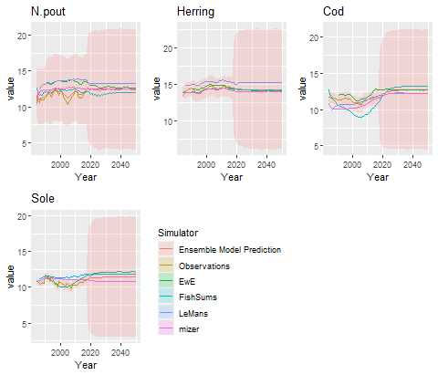

```{r, echo=FALSE,warning=FALSE,error=FALSE,message=FALSE}
library(rstan)
library(EcoEnsemble)
```

# Introduction

In this document we demonstrate the prior distributions and how to we chose the default priors, based on the example of four species in the North Sea.

# Truth
## Random walk parameter
The truth follows a multivariate random walk with covariance parameter $\Lambda_y$,
\begin{equation*}
\mathbf{y}_t\sim{}N(\mathbf{y}_{t-1},\Lambda_y).
\end{equation*}
In `EcoEnsemble`, the prior distribution for this parameter is the inverse Wishart distribution. The inverse Wishart distribution is descried by two parameters, the scale matrix $\Psi$ and the degrees of freedom $\nu$. \emph{apriori} we were unsure of correlations of the four species and therefore set the off diagonal elements of $\Psi$ to zero.

To get an idea of the diagonal elements were examined the marginal distribution of the diagonal elements of $\Lambda_y$. To do this we explored a univariate random walk,
\begin{equation*}
y_{t,i}\sim{}N(y_{t-1,i},\lambda^2).
\end{equation*}
If $y_{0,i}=0$, then the distribution after $T$ times is
\begin{equation*}
y_{T,i}\sim{}N(0,T\lambda^2).
\end{equation*}
The example in `EcoEnsemble` runs for 33 years without any observations from single-species models, and we can investigate what we believe the change in biomass is in 2050 relative to 2017, without any other information. To do this we will look sample from an inverse Wishart distribution, using `rstan`, with varying degrees of freedom.
```{r,eval=FALSE}
inv_wish_st_mod <- stan_model(model_code="data {
  int<lower=0> N;
  real nu;
  matrix[N,N] mat_cov;
}
parameters {
  cov_matrix[N] Sigma;
}
model {
  Sigma ~ inv_wishart(nu, mat_cov);
}
")
```

The lower the degrees of freedom, the less informative the prior. However, this comes at the expense of computational efficiency and $\nu > d-1$ is required. We therefore want $\nu$ to be as large as possible without excluding any plausible values. We look at 8 degrees of freedom:
```{r,eval=FALSE}
fit.iw <- sampling(inv_wish_st_mod,data=list(N=4,nu=2*4,mat_cov=diag(4)))
```

```{r echo=FALSE}
load("data/ExploringPriors_invWishartDensities.RData")
```

We look at the distribution of the first diagonal element
```{r eval = FALSE}
ex.fit.iw <- extract(fit.iw)
plot(density(ex.fit.iw$Sigma[,1,1]),main="",xlab=expression(lambda),xlim=c(0,2))
```
```{r plotDensity, echo = FALSE}
plot(invWishartDensity,main="",xlab=expression(lambda),xlim=c(0,2))
```

which in 2050 leads to
```{r eval = FALSE}
sd.2050 <- sqrt(33*ex.fit.iw$Sigma[,1,1])
plot(density(sqrt(33*ex.fit.iw$Sigma[,1,1])),main="",xlab="standard deviation in 2050",xlim=c(0,5))
```
```{r plotSDDensity, echo = FALSE}
plot(density(sd.2050),main="",xlab="standard deviation in 2050",xlim=c(0,5))
```

For example, this means that the SSB of cod in 2050, assuming in 2017 it is exactly the value from the assessment (@ices_ns), will be
```{r}
x <- seq(5,20,length.out=1000)
plot(x,colMeans(sapply(x, function(xs){dnorm(xs,tail(SSB_obs$Cod,n=1),sd.2050)})),type="l",axes=F,ylab="density",xlab="Cod in 2050 (1000 tonnes)")
labsx <- log(signif(exp(seq(5,20,length.out=7)),1))
axis(1,at=labsx,labels=c(exp(labsx)/1000))
axis(2)
abline(v=tail(SSB_obs$Cod,n=1))
abline(v=range(SSB_obs$Cod),lty=2)
box()
```

The solid vertical line is the assessment's SSB in 2017, with the dashed lines being the maximum and minimum SSB values from 1984 until 2017. Therefore we used the fairly uninformative prior
\begin{equation}
\lambda_y\sim\text{inv-Wishart}(I,8).
\end{equation}

## Initial distribution of SSB
We also require a prior on the distribution of SSB in 1983, that is
\begin{equation}
\mathbf{y}_{0}\sim{}N(0,1000).
\end{equation}


# Individual discrepancies

## Long-term Individual discrepancy
The long-term individual discrepancy for the $k$th model is
\begin{equation*}
\mathbf{\gamma}_k\sim{}N(0,C_{\gamma})
\end{equation*}
with
\begin{equation*}
C_{\gamma} = \Pi_{\gamma}  P_{\gamma} \Pi_{\gamma},
\end{equation*}
where $P_{\gamma}$ is a correlation matrix and $\Pi_{\gamma}=\text{diag}(\pi_{\gamma,1},\ldots,\pi_{\gamma,4})$. We put a uniform distribution on all correlation matrices,
\begin{equation*}
P_{\gamma} \sim{}LKJ(1),
\end{equation*}
and 
\begin{equation*}
\pi_{\gamma,i}^2 \sim{}\text{gamma}(1,1).
\end{equation*}
This prior gives more weight around zero but has an expectation of 1.
```{r}
xs <- seq(0,5,0.001)
plot(xs,dgamma(xs,1,1),xlab=expression(pi[gamma,i]^2),ylab="density",type="l")
```

The difference between two simulators,
\begin{equation*}
\gamma_{k,i} - \gamma_{l,i} \sim{}N(0,2\pi_{\gamma,i}^2),
\end{equation*}
for $k\neq{}l$.
The standard deviation of the difference of two models is
```{r}
pis <- rgamma(1e5,1,1)
plot(density(sqrt(2 * pis)),xlab="Standard deviation",ylab="Density",main="")
```

and the distribution of the absolute difference is
```{r}
xs <- seq(0,5,length.out=1000)
plot(xs,2*colMeans(sapply(xs, function(x){dnorm(x,0,sqrt(2 * pis))})),type="l",axes=T,ylab="density",xlab="Difference of two models")
```

We do not expect the models to differ by much than one order of magnitude and therefore we used this prior.

## Short-term Individual discrepancy
The short-term individual discrepancy for the $k$th model follows an auto-regressive process,
\begin{equation*}
\mathbf{z}_{k}^{(t)}\sim{}N(R_{k}\mathbf{z}_{k}^{(t-1)},\Lambda_{k})
\end{equation*}
with $R_{k}=\text{diag}(r_{k,1},\ldots,r_{k,4})$
\begin{equation*}
\Lambda_{k} = \Pi_{k}  P_{k} \Pi_{k},
\end{equation*}
where $P_{k}$ is a correlation matrix and $\Pi_{k}=\text{diag}(\pi_{k,1},\ldots,\pi_{k,4})$.

The distribution was
\begin{equation}
    f(P_k | \alpha, \beta) \propto \begin{cases}
    \prod_{i = 1}^{N-1}\prod_{j = i+ 1}^{N} \frac{1}{\mathrm{B}(\alpha_{\rho,i,j}, \beta_{\rho,i, j})} s(P_{k,i,j})^{\alpha_{\rho,i, j} - 1}\left(1-s(P_{k,i, j})\right)^{\beta_{\rho,i, j} - 1}&\text{if }P\text{ is positive definite}\\
    0 &\text{otherwise}.
    \end{cases}
\end{equation}
with 
\begin{equation}
    s(\rho)=\frac{\rho+1}{2},
\end{equation}
and hyperpriors
\begin{equation}
    \alpha_{\rho,i,j}\sim{}\text{gamma}(0.1,0.1)
\end{equation}
and
\begin{equation}
    \beta_{\rho,i,j}\sim{}\text{gamma}(0.1,0.1).
\end{equation}
Sampling from this prior
```{r,eval=FALSE}
cor_pri_st <- stan_model(model_code = " functions{
  real priors_cor_hierarchical_beta(matrix ind_st_cor, int N, matrix M){
    real log_prior = 0;
    for (i in 1:(N-1)){
      for (j in (i+1):N){
        log_prior += beta_lpdf(0.5*(ind_st_cor[i, j] + 1)| M[i, j], M[j, i] );
      }
    }
    return log_prior;
  }
}  
data {

  vector[4] cor_p;
}

parameters {
  matrix <lower=0>[5,5] beta_pars;
  corr_matrix[5] rho[4];
}
model {
  
  for (i in 1:4){
    for (j in (i+1):5){
      beta_pars[i,j] ~ gamma(cor_p[1],cor_p[2]);
      beta_pars[j,i] ~ gamma(cor_p[3],cor_p[4]);
    }
  }
  for(i in 1:4){
    target += priors_cor_hierarchical_beta(rho[i],5,beta_pars);
    diagonal(beta_pars) ~ std_normal();
  }
}
")
fit_cor <- sampling(cor_pri_st,data=list(cor_p=0.1 * c(1,1,1,1)),chains=4)
ex.fit <- extract(fit_cor)
def.par <- par(no.readonly=TRUE) #Old pars to reset afterwards
par(mfrow=c(2,2))
plot(density(ex.fit$beta_pars[,1,2]),xlab=expression(alpha[rho]),main="")
plot(density(log(ex.fit$beta_pars[,1,2]/ex.fit$beta_pars[,2,1])),main="",xlab="Expected log odds")
plot(density(ex.fit$rho[,1,1,2]),xlab=expression(rho),main="")
xs <- seq(-1,1,length.out=100)
lines(xs,dbeta((xs+1)/2,2,2)/2,col="red")
plot(density(apply(ex.fit$rho[,,1,2],1,var)),xlim=c(0,0.35),main="",xlab=expression(var(rho)))
par(def.par)
```

```{r echo=FALSE, fig.dim = c(7,6)}
def.par <- par(no.readonly=TRUE) #old pars
load("data/ExploringPriors_HierBetaDensities.RData")
par(mfrow=c(2,2))
plot(beta_marginal,xlab=expression(alpha[rho]),main="")
plot(expected_log_odds,main="",xlab="Expected log odds")
plot(rho_density,xlab=expression(rho),main="")
xs <- seq(-1,1,length.out=100)
lines(xs,dbeta((xs+1)/2,2,2)/2,col="red")
plot(rho_var_density,xlim=c(0,0.35),main="",xlab=expression(var(rho)))
```

The above plot shows the different aspects of the emergent distribution of this prior. The top left plot shows the marginal distribution of parameter of the beta distribution with the top right shows the log odds of the expectation of the beta distribution. The bottom left plot shows the marginal distribution of $\rho_{k,i,i}$, with the red curve being the distribution that gives a uniform distribution over all correlation matrices. We gave slightly more weight to correlation matrices that are less correlated. The bottom right plot shows the variance of $\rho_{k,i,i}$ over $k$. The variance of a uniform distribution between -1 and 1 is $1/3$ and the variance of the marginal distribution of uniform correlation parameters is $1/5$. We allowed the prior to be fairly uninformative over this space, as we were unsure how $\rho_{k,i,i}$ and $\rho_{l,i,i}$ related to one another, however, we do believe they may be similar and therefore we increased our beliefs around 0.

The $i$th diagonal element of $\Pi_k$, $\pi_{k,i}$, was
\begin{equation}
    \ln(\pi_{k,i}^2)\sim{}N(\mu_{\pi,i},\sigma_{\pi,i}^2),
\end{equation}
with zeros on the off diagonals. The hyperpriors were
\begin{equation}
    \mu_{\pi,i}\sim{}N(-3,1^2)
\end{equation}
and
\begin{equation}
    \sigma_{\pi,i}^2\sim{}\text{inv-gamma}(8,4).
\end{equation}
Sampling from this leads to
```{r,eval=FALSE}
st_mod1 <- stan_model(model_code = "data {
  vector[4] gam_p;
}
parameters {
  vector [5] log_sha_st_var[4];
  vector[5] gamma_mean;
  vector<lower=0> [5] gamma_var;
}
model {
  gamma_mean ~ normal(gam_p[1],gam_p[2]);
  gamma_var ~ inv_gamma(gam_p[3],gam_p[4]);
  for (i in 1:4){
    log_sha_st_var[i] ~ normal(gamma_mean,sqrt(gamma_var));
    
  }
}
generated quantities{
  vector[5] sha_st_var[4];
  for (i in 1:4){
    sha_st_var[i] = exp(log_sha_st_var[i]);
  }
}
")
test.fit_norm <- sampling(st_mod1,data=list(gam_p=c(-3,1,8,4)),chains=4)
ex.fit <- extract(test.fit_norm)
def.par <- par(no.readonly=TRUE) #old pars
par(mfrow=c(2,2))
plot(density(ex.fit$gamma_mean[,1]),main="",xlab=expression(mu[pi]))
plot(density(ex.fit$gamma_var[,1]),xlim=c(0,1),main="",xlab=expression(sigma[pi]^2))
plot(density(ex.fit$sha_st_var[,1,1]),xlim=c(0,1),main="",xlab=expression(pi["k,i"]^2))
plot(density(apply(ex.fit$sha_st_var[,,1],1,var)),xlim=c(0,0.2),xlab=expression(var(pi["k,i"]^2)) ,main="")
par(def.par)
```
```{r echo = FALSE,fig.dim=c(7, 6)}
load("data/ExploringPriors_HierGammaDensities.RData")
par(mfrow=c(2,2))
plot(gamma_mean,main="",xlab=expression(mu[pi]))
plot(gamma_var,xlim=c(0,1),main="",xlab=expression(sigma[pi]^2))
plot(sha_st_var,xlim=c(0,1),main="",xlab=expression(pi["k,i"]^2))
plot(sha_st_var_var,xlim=c(0,0.2),xlab=expression(var(pi["k,i"]^2)) ,main="")
```

The top left plot shows the marginal distribution of$\mu_{\pi,i}$ and the top right plot being $\sigma^2_{\pi,i}$. The bottom left plot shows the prior distribution of $pi_{k,i}^2$. For the same reason that describes the variance of the random walk on the truth, we felt that $\sigma^2_{\pi,i}$ should not be larger than 0.2. For a similar reason to the correlation parameters, the variance of $\sigma^2_{\pi,i}$ will also be small.

For the auto regressive parameter, $r_{k,i}$, we set a boundary avoiding prior
\begin{equation*}
\frac{r_{k,i} + 1}{2} \sim{}\text{beta}(2,2).
\end{equation*}
```{r}
hist(rbeta(1e5,2,2)*2 - 1,probability = T,xlab=expression(r["k,i"]),main="")
```

# Shared discrepancies

## Long-term shared discrepancy

We set the prior on the long-term shared discrepancy to be
\begin{equation*}
\mathbf{\delta}\sim{}N(0,5^2I).
\end{equation*}
This is a fairly vague prior as we did not expect the simulators to differ by the truth by more than 5 degrees of magnitude.

## Short-term shared discrepancy
The shared short-term discrepancy for the $k$th model follows an auto-regressive process,
\begin{equation*}
\mathbf{\eta}^{(t)}\sim{}N(R_{\eta}\mathbf{\eta}^{(t-1)},\Lambda_{\eta})
\end{equation*}
with $R_{\eta}=\text{diag}(r_{\eta,1},\ldots,r_{\eta,4})$
\begin{equation*}
\Lambda_{k} = \Pi_{k}  P_{k} \Pi_{k},
\end{equation*}
where $P_{\eta}$ is a correlation matrix and $\Pi_{\eta}=\text{diag}(\pi_{\eta,1},\ldots,\pi_{\eta,4})$.

We put a uniform prior on all correlation matrices,
\begin{equation*}
P_{\eta}\sim{}LKJ(1),
\end{equation*}
and, for similar reasons for the variance of the random walk on the truth we set
\begin{equation*}
\pi_{\eta,i}^2\sim{}\text{gamma}(1,10),
\end{equation*}
which has an expectation of 0.1, and is
```{r}
plot(density(rgamma(1e5,1,10)),xlim=c(0,0.5), main="",xlab=expression(pi[eta]^2))
```

and the standard deviation of
```{r}
plot(density(sqrt(rgamma(1e5,1,10))),xlim=c(0,0.5), main="",xlab=expression(pi[eta]))
```

For the auto regressive parameter, $r_{k,i}$, we set a boundary avoiding prior
\begin{equation*}
\frac{r_{\eta,i} + 1}{2} \sim{}\text{beta}(2,2)
\end{equation*}
or
```{r}
hist(rbeta(1e5,2,2)*2 - 1,probability = T,xlab=expression(r["k,i"]),main="")
```

# Prior predictive distribution
The prior predictive distribution is then
```{r,eval=FALSE,fig.dim=c(7,6)}
priors <- EnsemblePrior(4,
                        ind_st_params = IndSTPrior("hierarchical",list(-3,1,8,4),list(0.1,0.1,0.1,0.1),AR_params=c(2,2)),
                        ind_lt_params = IndLTPrior("lkj",list(1,1),1),
                        sha_st_params = ShaSTPrior("lkj",list(1,10),1,AR_params=c(2,2)),
                        sha_lt_params = 5
)
prior_density <- prior_ensemble_model(priors, M = 4)
samples <- sample_prior(observations = list(SSB_obs, Sigma_obs),
             simulators = list(list(SSB_ewe, Sigma_ewe,"EwE"),
                   list(SSB_fs ,  Sigma_fs,"FishSums"),
                   list(SSB_lm ,  Sigma_lm,"LeMans"),
                   list(SSB_miz, Sigma_miz,"mizer")),
             priors=priors,
             sam_priors = prior_density)
plot(samples)
```
```{r echo =FALSE,fig.dim=c(7,6)}

```

# References
