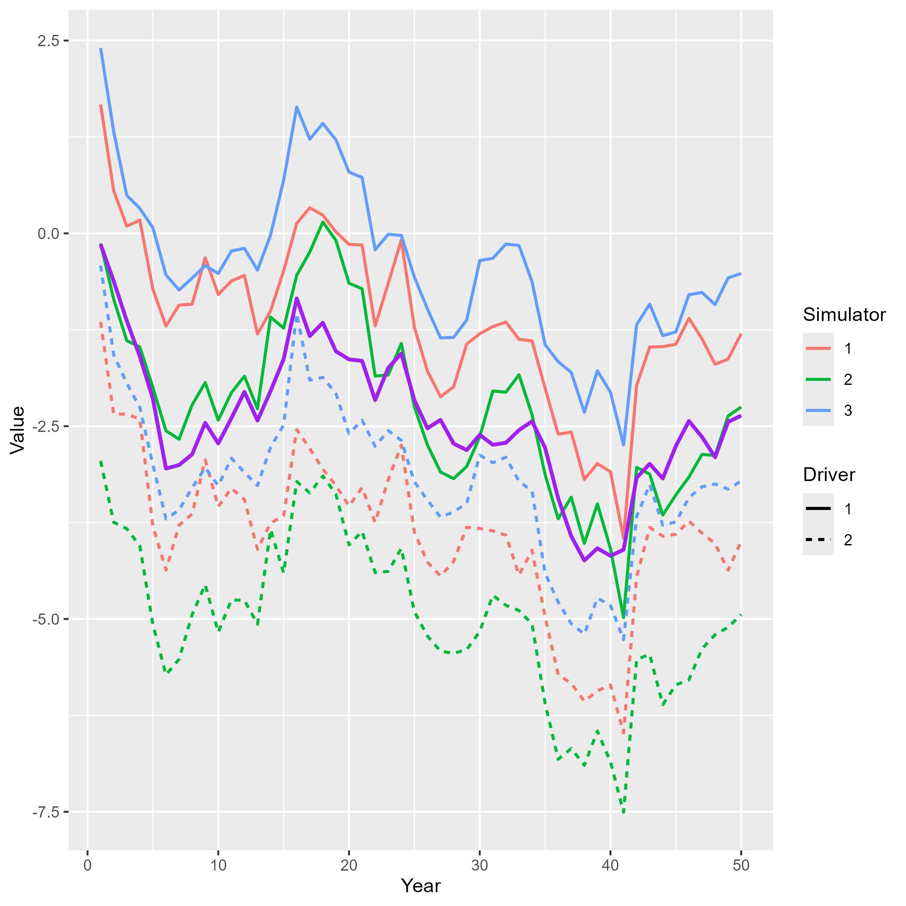
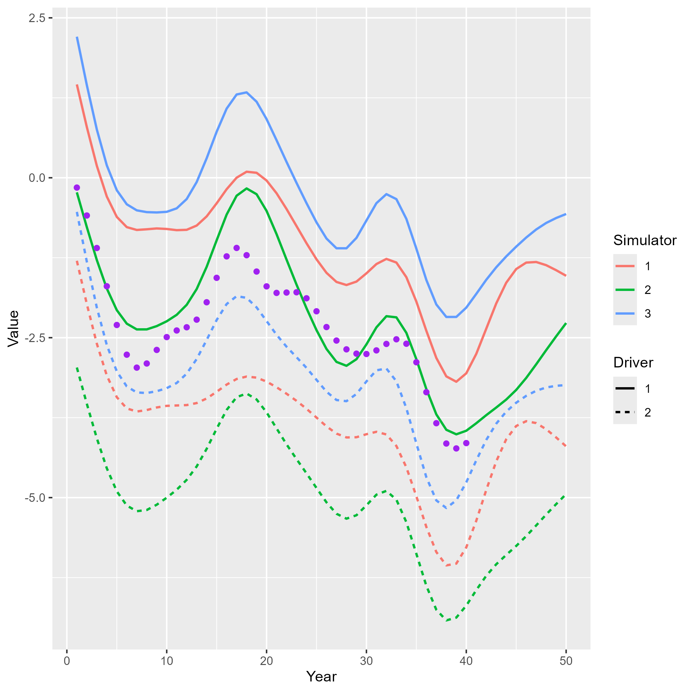
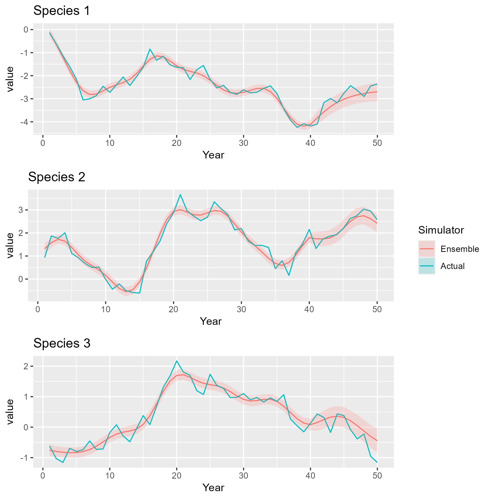
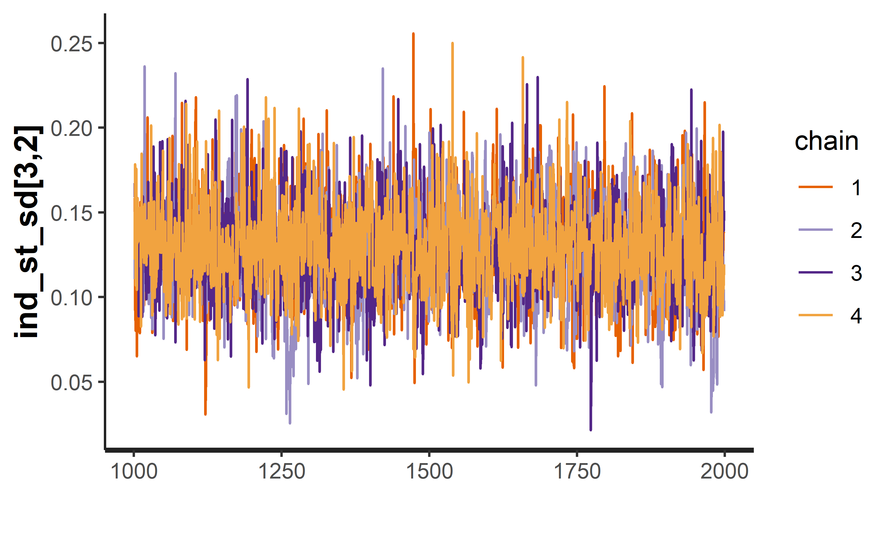

```{r setup_lies, warning=FALSE, message=FALSE, silent = TRUE}
library(EcoEnsemble)
library(mgcv)
library(ggplot2)
library(cowplot)
set.seed(5678)
```

# Introduction
Sometimes a set of simulators can be jointly affected by a process driving the dynamics. For example, the outputs of a set of ecosystem models (simulators) predicting the biomass of various species could be affected by a set of earth-system models (drivers) giving a set of combined ecosystem - earth system model outputs. `EcoEnsemble` allows fitting of an ensemble model to inputs resulting from such scenarios. These inputs should take the form of a set of simulator models and a set of driver models with the data being the output of simulator-driver pairs. Input data must be supplied for all simulator-driver combinations as fitting specific combinations is not currently supported.

# Model description

At time $t$, the $d$ variables of interest (VoI), $\mathbf{y}^{(t)}=(y_1^{(t)},\ldots,y_d^{(t)})'$, are described by $m$ simulators and $p$ drivers, which for $k=1,\ldots,m$ and $j=1,\ldots,p$ give $n_k$ outputs $\mathbf{\hat{x}}_{k,j}^{(t)}=(\hat{x}_{k,j,1}^{(t)},\ldots,\hat{x}_{k,j,n_{k}}^{(t)})'$ each relating to one of the variables of interest. We also have noisy observations of the variables of interest, $\hat{\mathbf{y}}^{(t)}=(\hat{y}_1^{(t)},\ldots,\hat{y}_d^{(t)})'$.

Not all of the simulator-driver pairs output all the variables over the whole time period. 
To accommodate these differences, we introduce a latent variable known as the "best guess", $\mathbf{x}_{k,j}^{(t)}=({x}_{1}^{(t)},\ldots,{x}_{d}^{(t)})'$, which represents the output if simulator $k$ and driver $j$ described all $d$ variables at time $t$ with no parameter uncertainty. In `EcoEnsemble`, variables of interest are either present or absent in each simulator-driver pair, therefore if the $k$th simulator and $j$th driver were evaluated at time $t$, their combined output is
$$
\mathbf{\hat{x}}_{k,j}^{(t)}\sim{}N(M_{k,j}\mathbf{x}_{k,j}^{(t)},\Sigma_{k,j}),
$$
where for each $j = 1,\ldots,p$, $M_{k,j}^{(t)}$ is an $n_k\times{}d$ matrix and $\Sigma_{k,j}$ reflects the combined parameter uncertainty of the $k$th simulator and the $j$th driver.

The variables of interest at time $t$ are equal to the "best guess" of simulator $k$ and driver $j$, $\mathbf{x}_{k,j}^{(t)}$, plus a discrepancy term, $\mathbf{\zeta}^{(t)}_{k,j}$ (@kennedy_ohagan), i.e. 
$$
\mathbf{y}^{(t)} =  \mathbf{x}_{k,j}^{(t)} + \mathbf{\zeta}^{(t)}_{k,j}.
$$
The discrepancy term, $\mathbf{\zeta}^{(t)}_{k,j}$, is split between discrepancies that are shared between all of the simulators/driver combinations, and discrepancies that were specific to each simulator/driver combination. The shared discrepancy is further split into long-term shared discrepancy $\delta$ and the short-term shared discrepancy $\mathbf\eta^{(t)}$. The discrepancies specific to each combination are also split into a discrepancy arising from the simulator and a discrepancy arising from the driver. These two discrepancies are further split into long-term individual discrepancies $\mathbf\gamma_k$ (simulator) and $\mathbf\iota_j$ (driver), and short-term individual discrepancies $\mathbf z_{k}^{(t)}$ (simulator) and $\mathbf\alpha_{j}^{(t)}$ (driver). Written together we have
$$
\mathbf{\zeta}^{(t)}_{k,j} = \mathbf\delta + \mathbf\eta^{(t)} + \mathbf\gamma_k + \mathbf{z}_k^{(t)} + \mathbf\iota_{j} + \mathbf\alpha_{j}^{(t)}.
$$
The long-term individual discrepancies for the $k$th simulator and $j$th driver are
$$
    \mathbf{\gamma}_k\sim{}N(\mathbf{0},C_{\gamma}) \hspace{10pt},\hspace{10pt} \mathbf{\iota}_j\sim{}N(\mathbf{0},C_{\iota}).
$$
The short-term discrepancy terms, $\mathbf\eta^{(t)}$, $\mathbf{z}_k^{(t)}$ and $\mathbf{\alpha}_j^{(t)}$, follow auto-regressive processes of order one, 
$$
\mathbf{\eta}^{(t)}\sim{}N(R_{\eta}\mathbf{\eta}^{(t-1)},\Lambda_{\eta})
$$
and
$$
\mathbf{z}_{k}^{(t)}\sim{}N(R_{k}\mathbf{z}_{k}^{(t-1)},\Lambda_{k}) \hspace{10pt},\hspace{10pt} \mathbf{\alpha}_{j}^{(t)}\sim{}N(Q_{j}\mathbf{\alpha}_{j}^{(t-1)},\Gamma_{j})
$$
respectively, where the diagonal elements of $R_i,  (i = \eta, 1, 2, \ldots, m )$ and $Q_j, (j = 1,2,\ldots,p)$ are between $-1$ and $1$, and the off-diagonal elements are $0$.


In the absence of any other information, the variables of interest evolve according to a random walk,
$$
\mathbf{y}^{(t)}\sim{}N(\mathbf{y}^{(t-1)},\Lambda_y),
$$
with noisy observations,
$$
\mathbf{\hat{y}}^{(t)}\sim{}N(\mathbf{y}^{(t)},\Sigma_y),
$$
when there are observations at time $t$.

## Dynamic linear model
As in the case without drivers, the ensemble model can be written as a dynamical linear model, by letting
\begin{equation}
\mathbf\theta^{(t)}=(\mathbf{y}^{(t)'},\mathbf\eta^{(t)'},\mathbf{z}_1^{(t)'},\ldots,\mathbf{z}_m^{(t)'},\mathbf{\alpha}_1^{(t)'},\ldots,\mathbf{\alpha}_p^{(t)'})',
\end{equation}
so that
\begin{equation}
\mathbf\theta^{(t)}|\mathbf\theta^{(t-1)}\sim{}N(A\mathbf\theta^{(t)},\Lambda),
\end{equation}
with
\begin{equation}
A= 
\begin{pmatrix}
I_d & 0 & 0 & 0 & \ldots & 0 & 0 & 0 & \ldots & 0\\
0 & R_\eta & 0 & 0 & \ldots & 0 & 0 & 0 & \ldots & 0\\
0  & 0 & R_1  & 0 & \ldots & 0 & 0 & 0 & \ldots & 0\\
0  & 0 & 0 & R_2  & \ldots & 0 & 0 & 0 & \ldots & 0\\
\vdots & \vdots & \vdots & \vdots & \ddots & \vdots & \vdots & \vdots & \ldots & \vdots\\
0  &  0 & 0 & 0 & \ldots & R_m & 0 & 0 & \ldots & 0\\
0  &  0 & 0 & 0 & \ldots & 0 & Q_1 & 0 & \ldots & 0\\
0  &  0 & 0 & 0 & \ldots & 0 & 0 & Q_2 & \ldots & 0\\
\vdots & \vdots & \vdots & \vdots & \vdots & \vdots & \vdots & \vdots & \ddots & \vdots\\
0  &  0 & 0 & 0 & \ldots & 0 & 0 & 0 & \ldots & Q_p\\
\end{pmatrix},
\end{equation}
with $I_d$ being a $d$ dimensional indicator matrix,
and
\begin{equation}
\Lambda=
\begin{pmatrix}
\Lambda_y & 0 & 0 & 0 & \ldots & 0 & 0 & 0 & \ldots & 0\\
0 & \Lambda_\eta & 0 & 0 & \ldots & 0 & 0 & 0 & \ldots & 0\\
0  & 0 & \Lambda_1  & 0 & \ldots & 0 & 0 & 0 & \ldots & 0\\
0  & 0 & 0 & \Lambda_2  & \ldots & 0 & 0 & 0 & \ldots & 0\\
\vdots & \vdots & \vdots & \vdots & \ddots & \vdots & \vdots & \vdots & \ldots & \vdots\\
0  &  0 & 0 & 0 & \ldots & \Lambda_m & 0 & 0 & \ldots & 0\\
0  &  0 & 0 & 0 & \ldots & 0 & \Gamma_1 & 0 & \ldots & 0\\
0  &  0 & 0 & 0 & \ldots & 0 & 0 & \Gamma_2 & \ldots & 0\\
\vdots & \vdots & \vdots & \vdots & \vdots & \vdots & \vdots & \vdots & \ddots & \vdots\\
0  &  0 & 0 & 0 & \ldots & 0 & 0 & 0 & \ldots & \Gamma_p\\
\end{pmatrix}.
\end{equation}
The observations
\begin{equation}
\mathbf{w}^{(t)}=(\mathbf{\hat{y}}^{(t)'},\mathbf{\hat{x}}^{(t)'}_{1,1},\ldots,\mathbf{\hat{x}}^{(t)'}_{1,p},\ldots,\mathbf{\hat{x}}^{(t)'}_{m,1},\ldots,\mathbf{\hat{x}}^{(t)'}_{m,p})'
\end{equation}
are 
\begin{equation}
S^{(t)}\mathbf{w}^{(t)}\sim{}N(S^{(t)}B(\mathbf{\theta}^{(t)} + \mathbf\zeta),S^{(t)}\Sigma S^{(t)'})
\label{eq:DLM_obs}
\end{equation}
where
\begin{equation}
B= 
\begin{pmatrix}
I_d & 0 & 0 & 0 & \ldots & 0 & 0 & 0 & \ldots & 0\\
M_{1,1} & M_{1,1} & M_{1,1} & 0  & \ldots & 0 & M_{1,1} & 0 &  \ldots & 0\\
M_{1,2}  & M_{1,2} & M_{1,2} & 0 & \ldots & 0 & 0 & M_{1,2} & \ldots & 0\\
\vdots & \vdots & \vdots & \vdots & \ddots & 0 & \vdots & \vdots & \ddots & \vdots\\
M_{1,p} & M_{1,p} & M_{1,p} & 0 & \ldots & 0 & 0 & 0 & \ldots & M_{1,p}\\
M_{2,1} & M_{2,1} & 0  & M_{2,1} & \ldots & 0 & M_{2,1} & 0 &  \ldots & 0\\
M_{2,2}  & M_{2,2} & 0 & M_{2,2} & \ldots & 0 & 0 & M_{2,2} & \ldots & 0\\
\vdots & \vdots & \vdots & \vdots & \ddots & 0 & \vdots & \vdots & \ddots & \vdots\\
M_{2,p} & M_{2,p} & 0 & M_{2,p} & \ldots & 0 & 0 & 0 & \ldots & M_{2,p}\\
\vdots & \vdots & \vdots & \vdots & \ddots & \vdots & \vdots & \vdots & \ddots & \vdots\\
M_{m,1} & M_{m,1} & 0 & 0 & \ldots & M_{m,1} & M_{m,1} & 0 & \ldots & 0\\
M_{m,2} & M_{m,2} & 0 & 0 & \ldots & M_{m,2} & 0 & M_{m,2} & \ldots & 0\\
\vdots & \vdots & \vdots & \vdots & \ddots & \vdots & \vdots & \vdots & \ddots & \vdots\\
M_{m,p} & M_{m,p} & 0 & 0 & \ldots & M_{m,p} & 0 & 0 & \ldots & M_{m,p}\\
\end{pmatrix},
\end{equation}
\begin{equation}
\mathbf\zeta=(\mathbf{0}',\mathbf{\delta}',\mathbf\gamma'_1,\ldots,\mathbf\gamma'_m,\mathbf\iota'_1,\ldots,\mathbf\iota'_p)',
\end{equation}
with
$\mathbf{0}$ being a $d$ dimensional vector of 0s,
\begin{equation}
\Sigma=
\begin{pmatrix}
\Sigma_y & 0 &\ldots & 0 & 0 & \ldots & 0\\
0 & \Sigma_{1,1} & \ldots & 0 & 0 & \ldots & 0\\
\vdots & \vdots  & \ddots & \vdots & \vdots & \ddots & \vdots \\
0  &  0  & \ldots & \Sigma_{1,p} & 0 & \ldots & 0 \\
0 & 0 & \ldots & 0 & \Sigma_{2,1} & \ldots & 0\\
\vdots & \vdots & \ddots & \vdots  & \vdots & \ddots & \vdots \\
0 & 0 & \ldots & 0 & 0 & \ldots & \Sigma_{m,p}
\end{pmatrix}
\end{equation}
and $S^{(t)}$ is a matrix that is used to describe which variables are observed at time $t$. The $S^{(t)}$ matrix is an $r(t) \times \left(d + \sum_{k=1}^m pn_k\right)$ matrix, where $r(t)$ is the total number of observations and simulator/driver outputs available at time $t$, with each element given by 
$$
S^{(t)}_{i, j} = 
\begin{cases}
  1 & \mathrm{if\ the \ }i^{th} \mathrm{\ available\ observation\ /\ output\ is\ the\ }j^{th}\mathrm{\ of\ all\ possible\ observation\ /\ outputs.} \\
  0 & \mathrm{otherwise}
\end{cases}
$$

For example, if all observations and the simulators/drivers give an output at time $t$ then $S^{(t)}=I_{d+\sum_{k=1}^{m}pn_k}$. If all simulators/drivers output the variables of interest but there are no observations then $S^{(t)}$ is a  $\left(\sum_{k=1}^m pn_k\right) \times \left(d + \sum_{k=1}^m pn_k\right)$ matrix, equal to $I_{d+\sum_{k=1}^{m}pn_k}$ with the first $d$ rows removed.

## Demonstration on synthetic data
Here we generate synthetic data for simulator/driver outputs and observations, then fit the ensemble model using these data. We do this for an ensemble model of 3 simulators and 2 drivers, each describing 3 variables of interest (which we imagine to be species biomass).

## Generating the data
We generate the synthetic data by sampling from an informative prior distribution of the ensemble model. We choose  priors with strong correlations of individual long-term discrepancies ($\mathrm{Beta}(5,1)$ via the method of concordance) and high autocorrelations of the AR processes on individual and shared short-term discrepancies ($\frac{r_i + 1}{2}\sim \mathrm{Beta}(10,2)$). These are different to the vague priors that will later be used to fit the model. We can configure this prior using the `EnsemblePrior()` constructor function.
```{r configure_priors, eval = FALSE}
d <- 3 # The number of variables.

priors <- EnsemblePrior(d,
                        ind_st_params = IndSTPrior(AR_params=c(10,2)), 
                        ind_lt_params = IndLTPrior("beta",
                                                   cor_params = list(matrix(5, d, d), 
                                                                     matrix(1, d, d)),var_params = list(1,0.5)),
                        sha_st_params = ShaSTPrior(AR_params=c(10,2)),
)
```

From this configuration, sampling the ensemble model parameters is done using the `prior_ensemble_model()` function. In this case we sample the prior of an ensemble model with $m_{1} = 3$ simulators and $m_{2} = 2$ drivers.

```{r sampling priors, eval = FALSE}
M <- 3 # The number of simulators we are considering.
MM <- 2 # The number of drivers we are considering.
prior_density <- prior_ensemble_model(priors, M = M, MM = MM)
ex.fit <- rstan::extract(prior_density$samples) # Extracted samples
```

Of these samples, the data we choose to make up our synthetic data is the single sample which maximizes the likelihood (see above section). The samples from the prior distribution provide us with $A$ and $\Lambda$ values. To get from these ensemble model parameters to simulated model outputs requires using the above transformations. Values of the truth and discrepancy terms are generated using these values and sums of discrepancy terms to give the "best guesses" of simulator/driver combined outputs.


```{r truth_best_guesses, eval = FALSE}
Time <- 50

true_par <-which.max(ex.fit$lp__)

latent <- matrix(NA, Time, (M+MM+2)*d)

#Priors on initial values
latent[1, 1:d] <- rnorm(d, 0, 1)
latent[1, -(1:d)] <- t(chol(ex.fit$SIGMA_init[true_par,-(1:d) ,-(1:d)])) %*% rnorm((M+MM+1)*d, 0, 1)

#Find all the latent values of the dynamic linear model
SIGMA <- ex.fit$SIGMA[true_par,,]
SIGMA_chol <- t(chol(SIGMA))
for (t in 2:Time) {
  latent[t,] <- ex.fit$AR_params[true_par,] * latent[t-1,] + SIGMA_chol %*% rnorm((M+MM+2)*d, 0, 1)
}

#The truth is simply the first d values
truth_latent <- latent[,1:d]

#The best guesses are sums of the truth and discrepancies
simulator_best_guesses <- array(NA,dim=c(Time,d,M*MM))
for(i in 1:M){
  for (j in 1:MM){
    simulator_best_guesses[,,MM*(i-1)+j] <- t(
      t(latent[,1:d] + latent[,(d+1):(2*d)] + latent[,(i + 1)*d + (1:d)] + latent[,(M + j + 1)*d + (1:d)]) + 
        ex.fit$ind_lt[true_par,i,] + ex.fit$ind_lt_dri[true_par,j,] + ex.fit$sha_lt[true_par,])
  }
}
```

We can see how the truth relates to simulator/driver best guesses by plotting these outputs, for example for the first variable.

```{r plot_data, eval = FALSE}
plotlist <- list()
for (sim in 1:M){
  for (dri in 1:MM){
    plotlist[[MM*(sim-1)+dri]] <- cbind(c(1:Time),simulator_best_guesses[,1,MM*(sim-1)+dri],rep(sim,Time),rep(dri,Time),rep("sim",Time))
  }
}
plot_df <- data.frame(rbind(do.call(rbind, plotlist), cbind(c(1:Time), truth_latent[,1], rep(0,Time), rep(0,Time), rep("truth",Time))))
names(plot_df) <- c("Year", "Value", "Simulator", "Driver", "Type")
plot_df$Year <- as.numeric(plot_df$Year)
plot_df$Value <- as.numeric(plot_df$Value)
bgplot <- ggplot2::ggplot(plot_df) + geom_line(data = plot_df[which(plot_df$Type == "sim"),], aes(x = Year, y = Value, color = Simulator, linetype = Driver), linewidth = 0.8) + geom_line(data = plot_df[which(plot_df$Type == "truth"),], aes(x = Year, y = Value), linewidth = 1, color = "purple")
```

```{r, echo = FALSE, out.width="500px", out.height="500px"}

```

Note in the above that the purple line represents the truth. In `EcoEnsemble`, we do not assume that we have access to the truth, nor the best guesses of each simulator/driver combination. Instead, `EcoEnsemble` assumes that simulator/driver outputs are noisy representations of the best guesses, and that observations are noisy representations of the truth. In order to produce the final synthetic dataset, we add noise to the simulated truth and best guesses. For simulators/drivers, this noise represents parameter uncertainty.

We use gams from the `mgcv` package to achieve this, and we overparametrise the model (by setting $k$ - the dimension of the basis used to represent the smooth term - to be something very large) to ensure that the outputs are sufficiently smooth.

In addition, we assume that we only have access to the first 40 years of observations.

```{r add_noise, eval = FALSE}
Times_obs <- round(Time * 0.8)
obs <- matrix(NA,Times_obs,d)
for(i in 1:d){
  g1 <- gam(y~s(x,k = 15),data=data.frame(x=1:Times_obs,y = truth_latent[1:Times_obs,i]))
  obs[,i] <- predict(g1)
}

obs.cov <- cov(obs - truth_latent[1:Times_obs,])


model.cov <- array(0,dim=c(M*MM,d,d))
models_output <- array(NA,dim=c(M*MM,Time,d))
for (j in 1:(M*MM)){
  for(i in 1:d){
    g1 <- gam(y~s(x, k = 15),data=data.frame(x=1:Time,y=simulator_best_guesses[,i,j]))
    models_output[j,,i] <- predict(g1)
  }
  model.cov[j,,] <- cov(models_output[j,,] - simulator_best_guesses[,,j])
}
```

We can see how this data compares to the best guesses by again plotting the first variable of interest.
```{r plot_obs, eval = FALSE}
#Observations and model outputs
plotlist <- list()
for (sim in 1:M){
  for (dri in 1:MM){
    plotlist[[MM*(sim-1)+dri]] <- cbind(c(1:Time),models_output[MM*(sim-1)+dri,,1],rep(sim,Time),rep(dri,Time),rep("sim",Time),rep("observed", Time))
  }
}
plot_df <- data.frame(rbind(do.call(rbind, plotlist), cbind(c(1:Time), c(obs[,1],rep(0, Time - max(Times_obs))), rep(0,Time), rep(0,Time), rep("truth",Time), c(rep("observed", max(Times_obs)),rep("unobserved", Time - max(Times_obs))))))
names(plot_df) <- c("Year", "Value", "Simulator", "Driver", "Type", "Obs_Status")
plot_df$Year <- as.numeric(plot_df$Year)
plot_df$Value <- as.numeric(plot_df$Value)
obsplot <- ggplot(plot_df) + geom_line(data=plot_df[which(plot_df$Type == "sim"),], aes(x = Year, y = Value, color = Simulator, linetype = Driver), linewidth = 0.8) + geom_point(data = plot_df[intersect(which(plot_df$Type == "truth"),which(plot_df$Obs_Status == "observed")),], aes(x = Year, y = Value), color = "purple") 
```

```{r, echo = FALSE, out.width="500px", out.height="500px"}

```

In the above graph, the purple points represent the observations, while the coloured and solid/dashed lines represent the simulator and driver outputs respectively.

## Fitting to Synthetic Data
We now need to convert the observations and simulator/driver outputs into the required form for `EcoEnsemble`. This requires that input columns and rows are named consistently with years and species so that data from different models can be matched to each other, and missing data accounted for. We create data frames for each simulator/driver combination and assign names.


```{r, eval = FALSE}
#Create the data frames that we'll use for EcoEnsemble
val_obs <- data.frame(obs); cov_obs <- obs.cov
val_model_11 <- data.frame(models_output[1,,]); cov_model_11 <- model.cov[1,,]
val_model_12 <- data.frame(models_output[2,,]); cov_model_12 <- model.cov[2,,]
val_model_21 <- data.frame(models_output[3,,]); cov_model_21 <- model.cov[3,,]
val_model_22 <- data.frame(models_output[4,,]); cov_model_22 <- model.cov[4,,]
val_model_31 <- data.frame(models_output[5,,]); cov_model_31 <- model.cov[5,,]
val_model_32 <- data.frame(models_output[6,,]); cov_model_32 <- model.cov[6,,]

#Set the dimnames to ensure EcoEnsemble can identify the information.
SPECIES_NAMES <- c("Species 1", "Species 2", "Species 3")
dimnames(val_obs) <- list(paste(1:Times_obs), SPECIES_NAMES)
dimnames(val_model_11) <- list(paste(1:Time), SPECIES_NAMES)
dimnames(val_model_21) <- list(paste(1:Time), SPECIES_NAMES)
dimnames(val_model_12) <- list(paste(1:Time), SPECIES_NAMES)
dimnames(val_model_22) <- list(paste(1:Time), SPECIES_NAMES)
dimnames(val_model_31) <- list(paste(1:Time), SPECIES_NAMES)
dimnames(val_model_32) <- list(paste(1:Time), SPECIES_NAMES)

dimnames(cov_obs) <- list(SPECIES_NAMES, SPECIES_NAMES)
dimnames(cov_model_11) <- list(SPECIES_NAMES, SPECIES_NAMES)
dimnames(cov_model_21) <- list(SPECIES_NAMES, SPECIES_NAMES)
dimnames(cov_model_12) <- list(SPECIES_NAMES, SPECIES_NAMES)
dimnames(cov_model_22) <- list(SPECIES_NAMES, SPECIES_NAMES)
dimnames(cov_model_31) <- list(SPECIES_NAMES, SPECIES_NAMES)
dimnames(cov_model_32) <- list(SPECIES_NAMES, SPECIES_NAMES)

val_model_1 <- list(val_model_11, val_model_12)
val_model_2 <- list(val_model_21, val_model_22)
val_model_3 <- list(val_model_31, val_model_32)
cov_model_1 <- list(cov_model_11, cov_model_12)
cov_model_2 <- list(cov_model_21, cov_model_22)
cov_model_3 <- list(cov_model_31, cov_model_32)
```

Now we can fit the ensemble model, this time using vague default priors.
```{r fitting, eval = FALSE}
fit <- fit_ensemble_model(observations = list(val_obs, cov_obs),
                                             simulators = list(list(val_model_1, cov_model_1, "Simulator 1", c("Driver 1", "Driver 2")),
                                                               list(val_model_2, cov_model_2, "Simulator 2", c("Driver 1", "Driver 2")),
                                                               list(val_model_3, cov_model_3, "Simulator 3", c("Driver 1", "Driver 2"))
                                             ),
                                             priors = EnsemblePrior(d),
                                             control = list(adapt_delta = 0.9),drivers=T)
samples <- generate_sample(fit)
```
## Results

We can compare the truth as predicted by the ensemble model with the original truth value.
```{r results, eval = FALSE}
df_list <- list()
for (var_index in 1:3){
  df <- data.frame("Year" = paste(1:Time),
                   "Ensemble" = apply(samples@mle[, var_index, ], 1, median),
                   "Lower"  = apply(samples@samples[, var_index, ], 1, quantile, 0.1),
                   "Upper"  = apply(samples@samples[, var_index, ], 1, quantile, 0.9),
                   "Actual" = truth_latent[,var_index])
  df$Year <- as.numeric(df$Year)
  df <-  reshape2::melt(df, id.vars=c("Year", "Lower", "Upper"), variable.name="Simulator")
  # We only want uncertainty bands for the Ensemble values, else we set zero width bands 
  df[df$Simulator == "Actual", c("Lower", "Upper")] <- df[df$Simulator != "Actual", "value"]
  df$Species = rep(SPECIES_NAMES[var_index], Time)
  df_list[[var_index]] <- ggplot(df, aes(x=`Year`, y=`value`)) +
  geom_line(aes(group=`Simulator`,colour=`Simulator`)) +
  geom_ribbon(aes(ymin=`Lower`, ymax =`Upper`, fill = `Simulator`), alpha=0.2) + ggplot2::ggtitle(SPECIES_NAMES[var_index]) + ggplot2::theme(legend.position = "right")
}

legend <- cowplot::get_plot_component(df_list[[1]], "guide-box-right")
df_list <- lapply(df_list, function(x) {x + ggplot2::theme(legend.position = "none")})
output_plot_nolegend <- cowplot::plot_grid(plotlist=df_list, nrow = 3, ncol = 1)
output_plot <- cowplot::plot_grid(output_plot_nolegend, legend, rel_widths = c(4,1), nrow = 1, ncol = 2)
```

```{r plot_truth, echo = FALSE, out.width="600px", out.height="600px"}

```

Here we see that, with the chosen priors, the ensemble model does a reasonable job at capturing the true value. 

## Checking the fit

To check that our ensemble estimates above are valid we can run `rstan`'s built-in MCMC diagnostics (@rstan). These include the $\hat{R}$ statistic and the bulk and tail effective sample size. The $\hat{R}$ diagnostic compares the variances of the between and within-chain estimates for model parameters. As these should be similar, an $\hat{R}$ value of below 1.05 is usually indicative that the chains have mixed well. Note that we remove `NA` values as these indicate non-moving chains, which is expected for some parameters such the diagonal entries of the correlation matrix `ind_st_cor` (identically equal to 1).

```{r, eval = FALSE}
samples_array <- as.array(fit@samples)
#Drop last element of third dimension as this is "lp__"
max(apply(samples_array[,,-dim(samples_array)[3]], 3, rstan::Rhat), na.rm = TRUE)
min(apply(samples_array[,,-dim(samples_array)[3]], 3, rstan::ess_bulk), na.rm = TRUE)
min(apply(samples_array[,,-dim(samples_array)[3]], 3, rstan::ess_tail), na.rm = TRUE)
```

```{r,echo=FALSE}
1.007311; 836.737; 559.6022
```

We also wish to check that `rstan`'s NUTS sampler has not encountered too many divergent transitions. This is achieved by running the `check_divergences` function.

```{r, eval = FALSE}
rstan::check_divergences(fit@samples)
```

```{r, echo = FALSE}
message(sprintf("%s of %s iterations ended with a divergence (%s%%).", 
            5, 4000, 100 * 5/4000), "\nTry increasing 'adapt_delta' to remove the divergences.")
```

This is a low number of divergences and does not indicate any issues with our posterior sample. We can also produce trace plots of some of the parameters to check mixing. For example, the plot below is the trace plot of the post burn-in iterations of `ind_st_sd[3,2]`, the short-term standard deviation of the 3rd simulator's best guess for the 2nd variable of interest.

```{r, eval = FALSE, fig.dim = c(7,4)}
rstan::traceplot(fit@samples, pars = "ind_st_sd[3,2]")
```

```{r, echo = FALSE, out.width = "500px", out.height = "300px"}

```

The four chains are visually mixing well for this parameter.

# References
